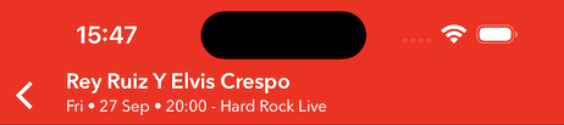
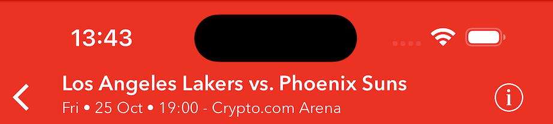
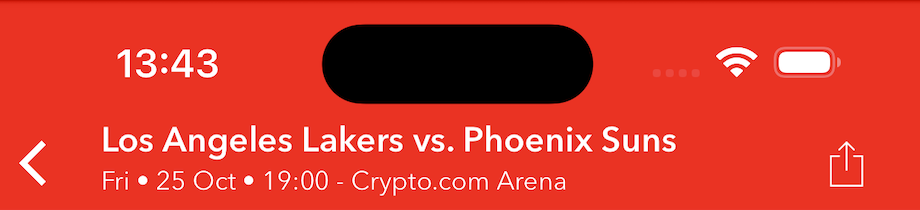
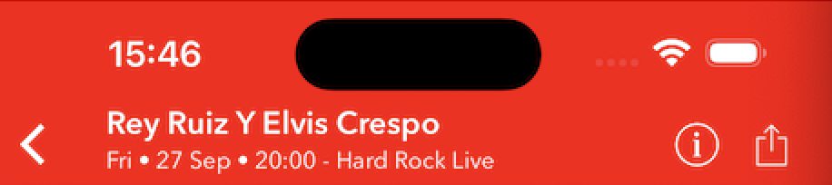

<svg width="300" height="101" viewBox="0 0 114 41" fill="none" xmlns="http://www.w3.org/2000/svg">
<rect width="300" height="104" fill="#024DDF"/>
<g transform="translate(2, 3)">
<path fill-rule="evenodd" clip-rule="evenodd" d="M69.2747 13.4407C71.2878 13.4407 71.909 12.0552 72.3299 10.3955H71.3892C70.081 10.3955 67.9132 10.6138 67.9132 12.3622C67.9132 13.0829 68.5978 13.4483 69.2747 13.4483V13.4407ZM71.909 13.5803H71.8684C70.9455 14.7451 70.0227 15.4074 68.5369 15.4074C66.6658 15.4074 65.3424 14.3644 65.3424 12.4536C65.3424 9.03531 69.1454 8.77393 71.6808 8.77393H72.6214C72.6916 8.4834 72.7198 8.18429 72.7051 7.88575C72.7051 6.8453 71.5769 6.54332 70.6362 6.54332C69.4588 6.55674 68.2989 6.82966 67.2388 7.34268L67.6191 5.19581C68.7475 4.78982 69.9366 4.57873 71.1357 4.57155C73.2071 4.57155 75.1517 5.33285 75.1517 7.76648C75.1517 9.15712 74.1376 13.2174 73.884 15.1714H71.6022L71.909 13.5803ZM2.12535 4.80247H4.06745L4.53142 2.67336L7.42428 1.72681L6.76508 4.80247H9.17115L8.75028 6.7717H6.33661L5.35542 11.2989C5.27405 11.6311 5.23319 11.972 5.23372 12.314C5.228 12.4488 5.25083 12.5832 5.3007 12.7086C5.35057 12.8339 5.42635 12.9472 5.52308 13.0412C5.61981 13.1351 5.73529 13.2075 5.86195 13.2536C5.98861 13.2998 6.12359 13.3185 6.25801 13.3088C6.70213 13.3082 7.14259 13.2283 7.55866 13.0728L7.09975 15.1562C6.6273 15.2908 6.14211 15.3759 5.65206 15.41C3.82659 15.41 2.53862 14.6969 2.53862 12.6997C2.56626 11.8855 2.68014 11.0765 2.87836 10.2864L3.63897 6.7844H1.69434L2.12535 4.80247ZM11.2654 0.336165H13.9529L13.3926 2.9119H10.6974L11.2654 0.336165ZM10.2791 4.79739H12.9641L10.7608 15.1537H8.06573L10.2791 4.79739ZM21.1052 7.17266C20.5091 6.81591 19.8245 6.63472 19.1301 6.6499C16.9826 6.6499 15.7733 8.66481 15.7733 10.6112C15.7733 11.9587 16.222 13.3062 18.0678 13.3062C18.8262 13.2912 19.5724 13.1129 20.2558 12.7835L19.949 14.9202C19.1333 15.276 18.2467 15.4393 17.3579 15.3973C14.6831 15.3973 12.9565 13.6209 12.9565 10.9386C12.9565 7.31731 15.3448 4.56393 19.0616 4.56393C19.9749 4.56521 20.8831 4.70116 21.7568 4.96742L21.1052 7.17266ZM24.0513 0.0823975H26.7438L24.9539 8.56584H24.9995L28.7519 4.80247H32.2481L27.2864 9.53016L30.3998 15.1562H27.3701L24.6927 9.66973H24.6547L23.4986 15.1562H20.8592L24.0513 0.0823975ZM41.9561 4.80247H43.9007L44.3647 2.67336L47.2575 1.72681L46.5933 4.80247H49.0044L48.5988 6.7717H46.1825L45.1963 11.2989C45.1185 11.6317 45.0785 11.9722 45.0771 12.314C45.0698 12.4497 45.0916 12.5855 45.141 12.7121C45.1904 12.8387 45.2662 12.9533 45.3634 13.0482C45.4607 13.1431 45.577 13.2162 45.7047 13.2624C45.8325 13.3087 45.9686 13.3271 46.104 13.3164C46.548 13.3155 46.9885 13.2356 47.4046 13.0804L46.9432 15.1638C46.4726 15.2991 45.989 15.3841 45.5005 15.4176C43.6725 15.4176 42.3871 14.7045 42.3871 12.7073C42.4135 11.893 42.5274 11.0839 42.7268 10.294L43.4874 6.79201H41.5327L41.9561 4.80247ZM41.0535 8.5024C41.0483 9.27799 40.9634 10.051 40.7999 10.8091H34.4615C34.4627 10.1848 34.5593 9.56439 34.748 8.96933H38.4319C38.47 8.73524 38.4895 8.4985 38.4902 8.26133C38.4902 7.15744 37.9071 6.5357 36.7839 6.5357C35.1993 6.5357 34.4666 7.44419 33.9519 8.76378C33.6729 9.41013 33.5239 10.1051 33.5133 10.8091V10.903C33.5133 11.002 33.5285 11.0959 33.5285 11.1898C33.6629 12.819 34.6643 13.428 36.3859 13.428C37.4853 13.4155 38.5686 13.1626 39.5602 12.687L39.2153 14.8212C38.1503 15.172 37.0401 15.366 35.9194 15.3973C32.9428 15.3973 30.9348 13.9559 30.9348 10.8777C30.9348 7.6599 33.4296 4.56393 36.8245 4.56393C39.3776 4.56393 41.0636 5.86829 41.0636 8.5024H41.0535ZM50.1682 5.9495C50.2442 5.54601 50.3253 5.12983 50.3862 4.79993H52.9089L52.668 6.18804H52.7061C53.0626 5.67798 53.5386 5.26319 54.0924 4.98004C54.6463 4.6969 55.2611 4.55402 55.8829 4.56393C57.1049 4.56393 58.3752 5.28717 58.5121 6.5357H58.5526C59.2321 5.18566 60.7432 4.56393 62.1884 4.56393C62.9437 4.56451 63.6686 4.86233 64.2065 5.39312C64.7443 5.92391 65.0522 6.6451 65.0635 7.40105C65.025 8.35364 64.87 9.29793 64.602 10.2128L63.5068 15.1562H60.8142L61.8968 10.1138C62.0777 9.38821 62.1914 8.64747 62.2365 7.90097C62.2412 7.73401 62.2115 7.56786 62.1492 7.41291C62.0869 7.25796 61.9933 7.11753 61.8744 7.00037C61.7554 6.88322 61.6136 6.79185 61.4578 6.73199C61.302 6.67213 61.1356 6.64505 60.9688 6.65244C59.1028 6.65244 58.6388 8.82469 58.2966 10.2356L57.2342 15.1562H54.5493L55.6268 10.1138C55.8118 9.38887 55.9273 8.64789 55.9716 7.90097C55.9756 7.73421 55.9453 7.5684 55.8827 7.41379C55.8202 7.25918 55.7266 7.11905 55.6078 7.00205C55.489 6.88505 55.3475 6.79366 55.1921 6.73353C55.0366 6.6734 54.8705 6.64581 54.7039 6.65244C52.881 6.65244 52.3714 8.84245 52.0317 10.2356L50.9693 15.1562H48.2768L50.1682 5.9495ZM83.161 6.91382C82.5943 6.66223 81.9808 6.53337 81.3609 6.5357C80.5622 6.5357 79.5607 6.75648 79.5607 7.57869C79.5607 8.88559 83.057 9.35506 83.057 11.8927C83.057 14.5877 80.6991 15.3897 78.3843 15.3897C77.3027 15.418 76.2283 15.2065 75.2379 14.7705L75.8185 12.6185C76.5791 13.0423 77.3398 13.4204 78.3843 13.4204C79.2945 13.4204 80.2402 13.121 80.2402 12.2785C80.2402 10.6061 76.7414 10.4463 76.7414 7.8553C76.7414 5.41913 79.0942 4.55632 81.2316 4.55632C82.0797 4.56186 82.9241 4.66921 83.7467 4.87607L83.161 6.91382ZM84.88 4.80247H86.8347L87.2911 2.67336L90.1789 1.72681L89.5172 4.80247H91.9308L91.5049 6.7717H89.0887L88.1126 11.2989C88.0276 11.6305 87.9859 11.9717 87.9883 12.314C87.9815 12.4496 88.0035 12.5852 88.053 12.7116C88.1026 12.838 88.1784 12.9525 88.2756 13.0473C88.3727 13.1421 88.4889 13.2152 88.6164 13.2615C88.7439 13.3079 88.8799 13.3266 89.0152 13.3164C89.4601 13.316 89.9014 13.2361 90.3183 13.0804L89.862 15.1638C89.3894 15.2978 88.9043 15.3829 88.4143 15.4176C86.5863 15.4176 85.3008 14.7045 85.3008 12.7073C85.3267 11.8933 85.4389 11.0843 85.6355 10.294L86.3961 6.79201H84.4515L84.88 4.80247ZM103.135 6.18804C103.221 5.74649 103.297 5.28717 103.388 4.80247H105.959L105.594 6.75648H105.642C106.119 5.62721 107.447 4.56393 108.685 4.56393C109.025 4.55751 109.365 4.58986 109.699 4.66037L109.136 7.29701C108.808 7.19064 108.466 7.13586 108.122 7.1346C106.213 7.1346 105.287 8.84245 104.942 10.5148L103.984 15.1562H101.281L103.135 6.18804ZM101.266 8.5024C101.263 9.27814 101.178 10.0514 101.013 10.8091H94.6741C94.6739 10.1845 94.7714 9.56373 94.9631 8.96933H98.642C98.6805 8.73521 98.7017 8.49857 98.7054 8.26133C98.7054 7.15744 98.1222 6.5357 96.9965 6.5357C95.4068 6.5357 94.6767 7.44165 94.1645 8.76378C93.8871 9.41074 93.7373 10.1053 93.7234 10.8091L93.7386 11.1898C93.8653 12.819 94.8668 13.428 96.5934 13.428C97.6912 13.416 98.773 13.163 99.7626 12.687L99.4279 14.8212C98.3626 15.1708 97.2526 15.3648 96.132 15.3973C93.163 15.3973 91.1525 13.9559 91.1525 10.8777C91.1525 7.6599 93.6422 4.56393 97.0371 4.56393C99.5902 4.56393 101.276 5.86829 101.276 8.5024H101.266Z" fill="white"/>
<path d="M1.75945 35.4175H5.83819C10.3168 35.4175 13.1559 32.5384 13.1559 28.3397C13.1559 24.141 10.2568 21.2219 5.77821 21.2219H1.75945V35.4175ZM2.8991 34.3778V22.2616H5.77821C9.51705 22.2616 11.9763 24.7608 11.9763 28.3397C11.9763 31.8586 9.61701 34.3778 5.77821 34.3778H2.8991ZM16.0714 35.4175H24.9687V34.3778H17.2111V28.8595H23.3092V27.8198H17.2111V22.2616H24.5488V21.2219H16.0714V35.4175ZM31.8885 35.4175H32.9482L38.3465 21.2219H37.1269L32.4484 33.738H32.4084L27.7098 21.2219H26.4902L31.8885 35.4175ZM40.6732 35.4175H49.5704V34.3778H41.8128V28.8595H47.9109V27.8198H41.8128V22.2616H49.1505V21.2219H40.6732V35.4175ZM52.2516 35.4175H60.8289V34.3778H53.3912V21.2219H52.2516V35.4175ZM69.0198 35.5174C72.9386 35.5174 76.0376 32.6183 76.0376 28.2997C76.0376 24.001 72.9386 21.1219 69.0198 21.1219C65.0211 21.1219 61.962 24.041 61.962 28.2997C61.962 32.5784 65.0211 35.5174 69.0198 35.5174ZM69.0198 34.4378C65.7008 34.4378 63.1217 31.9186 63.1217 28.2997C63.1217 24.7208 65.7008 22.2016 69.0198 22.2016C72.2388 22.2016 74.858 24.6608 74.858 28.2997C74.858 31.9586 72.2388 34.4378 69.0198 34.4378ZM79.0011 35.4175H80.1407V29.6793H83.4997C86.3788 29.6793 88.3782 28.3797 88.3782 25.4206C88.3782 23.0213 87.0586 21.2219 83.8396 21.2219H79.0011V35.4175ZM80.1407 28.6196V22.2616H83.7996C85.839 22.2616 87.1985 23.3212 87.1985 25.4206C87.1985 27.24 86.1389 28.6196 83.3997 28.6196H80.1407ZM90.9505 35.4175H99.8477V34.3778H92.0902V28.8595H98.1883V27.8198H92.0902V22.2616H99.4279V21.2219H90.9505V35.4175ZM102.529 35.4175H103.669V29.6793H106.808L110.846 35.4175H112.226L108.067 29.5793C110.446 29.2794 111.946 27.9598 111.946 25.4206C111.946 23.0213 110.566 21.2219 107.387 21.2219H102.529V35.4175ZM103.669 28.6196V22.2616H107.287C109.427 22.2616 110.766 23.3212 110.766 25.4206C110.766 27.24 109.707 28.6196 106.988 28.6196H103.669Z" fill="white"/>
</g>
</svg>


# react-native-ticketmaster-ignite
[](https://www.npmjs.com/package/react-native-ticketmaster-ignite)  [](LICENSE) 

This library serves as a wrapper for the 3 Ticketmaster Ignite SDK's: [Accounts](https://ignite.ticketmaster.com/docs/accounts-sdk-overview), [Retail](https://ignite.ticketmaster.com/docs/retail-sdk-overview) and [Tickets](https://ignite.ticketmaster.com/docs/tickets-sdk-overview).

In order to use the library, setup a developer account with Ticketmaster by contacting nexus_sdk@ticketmaster.com. When your account is activated you will receive an **API key** and **scheme** that you'll need to use to finish the setup (see the setting variables paragraph below).

## Installation

#### NPM

```bash
npm install --save react-native-ticketmaster-ignite
```

#### Yarn
```bash
yarn add react-native-ticketmaster-ignite
```

#### Expo

```bash
npx expo install react-native-ticketmaster-ignite
```

## Setting up iOS

Edit the `Podfile` and set the platform to `15.0`

```
platform :ios, '15.0'
```

- `cd` into the `ios` directory and run `pod install`

## Setting up Android

#### TM scheme

In your project go to `android/app/src/main/res/values/strings.xml` and add this snippet:

```xml
<string name="app_tm_modern_accounts_scheme">samplescheme</string>
```

Replace `samplescheme` with your scheme - you can find it in your Ticketmaster app settings.

#### Multi Scheme

If you have multiple schemes you can add them using the following format:

```xml
<string name="app_tm_modern_accounts_scheme">samplescheme1</string>
<string name="app_tm_modern_accounts_scheme_2">samplescheme2</string>
<string name="app_tm_modern_accounts_scheme_3">samplescheme3</string>
<string name="app_tm_modern_accounts_scheme_4">samplescheme4</string>
<string name="app_tm_modern_accounts_scheme_5">samplescheme5</string>
```

You can set up to 5 schemes

#### allowBackup in AndroidManifest

Open the `AndroidManifest.xml` file and:

- make sure that the `manifest` contains `xmlns:tools="http://schemas.android.com/tools"`
- add `tools:replace="android:allowBackup"` to the `application`

```xml
<manifest xmlns:android="http://schemas.android.com/apk/res/android"
          xmlns:tools="http://schemas.android.com/tools"
          package="com.yourpackage">

    <application tools:replace="android:allowBackup">
      <activity>
      ...
      </activity>
    </application>
</manifest>
```

#### Set dataBinding to true

In `android/app/build.gradle` add:

```groovy
android {
  ...
    buildFeatures {
        dataBinding = true
    }
  ...
}
```

#### Set the minSdkVersion

In `android/build.gradle` set the `minSdkVersion` to `26` and set the `compileSdkVersion` to `35`.

## Setting up Expo

If you are using an expo managed workflow you can use a config plugin to update your native files. See [here](./docs/expo.md) for an example config plugin written for an expo app that uses this library

## Usage

`react-native-ticketmaster-ignite` exports the following modules:

- `IgniteProvider`
- `AccountsSDK`
- `TicketsSdkModal` (iOS only)
- `TicketsSdkEmbedded`
- `RetailSDK`
- `useIgnite`

#### IgniteProvider

This is the only module that must be implemented for the library to work correctly. The purpose of `IgniteProvider` is to pass the config `options` to the native code.

Props required in `options` are:

- `apiKey`
- `clientName`
- `primaryColor`

Additional available props are: 
- `region`
- `eventHeaderType`

In order to use it, wrap your application with the `IgniteProvider` and pass the API key and client name as a prop:

```typescript
import { IgniteProvider } from 'react-native-ticketmaster-ignite';

<IgniteProvider
  options={{
    apiKey: API_KEY,
    clientName: CLIENT_NAME,
    primaryColor: PRIMARY_COLOR
  }}
>
    <App />
</IgniteProvider>
```

##### The `region` property

The options prop also accepts a `region` property `US` or `UK`. The default value is `US` and should be used unless you have specifically been told to set your region to `UK`.

##### The `eventHeaderType` property 

The `eventHeaderType` property accepts one of the following values - `NO_TOOLBARS`, `EVENT_INFO`, `EVENT_SHARE` and `EVENT_INFO_SHARE`. When the property has not been passed, the `IgniteProvider` will default to `EVENT_INFO_SHARE`. 

The `eventHeaderType` property specifies what tools will be available in the header of the event screen:

| Property | Explanation | Demo |
|----------|----------|----------|
| `NO_TOOLBARS`    | Show no toolbars in Event's header   |  |
| `EVENT_INFO`    | Show only the event info button ||
| `EVENT_SHARE`   | Show only the event share button   ||
| `EVENT_INFO_SHARE`    | Show both the info and share buttons   ||

##### The `autoUpdate` prop 

`autoUpdate` is a prop that can be set to false to prevent `IgniteProvider` from rerendering your app on app launch. (⚠️ warning: if set to `false`, `authState`'s `isLoggedIn`, `memberInfo` and `isConfigured` will not automatically update and you will have to call `getMemberInfo` and `getIsLoggedIn` manually after app restarts. The default value is `true`. See more on `authState` later on.)

```typescript
import { IgniteProvider } from 'react-native-ticketmaster-ignite';

<IgniteProvider
  options={{
    apiKey: API_KEY,
    clientName: CLIENT_NAME,
    primaryColor: PRIMARY_COLOR
  }}
  autoUpdate={false}
>
    <App />
</IgniteProvider>
```

#### AccountsSDK

Exposes the following functions:

- `configureAccountsSDK` - Configured in `IgniteProvider` before `<App />` is mounted, generally no need to implement this method manually.
- `login`
- `logout`
- `refreshToken`
- `getMemberInfo`
- `getToken`
- `isLoggedIn`

#### useIgnite

To handle authentication in a React Native app you can either use the Accounts SDK module mentioned above directly or you can use the `useIgnite` hook.

The `useIgnite` hook implements all of the native Accounts SDK methods for easy out of the box use in a React Native apps. It also provides `isLoggingIn` and an `authState` object with properties `isLoggedIn`, `memberInfo` and `isConfigured`, these properties update themselves during and after authenticaion.

Once the user authenticates `isLoggedIn` will remain true after app restarts

`isConfigured` becomes true after the SDK has successfully configured and the local storage `isLoggedIn` value and `memberInfo` response data have both been retrieved from by the SDK. This makes it useful to condition for any splash screen, loading spinners or animations during app launch.

Example:

```tsx
import { ActivityIndicator, Text } from 'react-native';
import { useIgnite } from 'react-native-ticketmaster-ignite';

const {
  login,
  logout,
  getToken,
  getMemberInfo,
  getIsLoggedIn,
  isLoggingIn,
  refreshToken,
  refreshConfiguration,
  authState: { isLoggedIn, memberInfo, isConfigured },
} = useIgnite();

try {
  await login();
} catch (e) {
  console.log('Accounts SDK login error:', (e as Error).message);
}

{
  !!isLoggingIn && (
    <View style={styles.activityIndicator}>
      <ActivityIndicator color={'blue'} size={'small'} />
    </View>
  );
}

{isLoggedIn && <Text>You are logged in<Text/>}
```

`getToken` and `refreshToken` return different data types per platform. iOS returns a `string` and Android returns an object. See Android object type below: 

```typescript
type AuthSource = {
  hostAccessToken?: string;
  archticsAccessToken?: string;
  mfxAccessToken?: string;
  sportXRAccessToken?: string;
};
```

You can see the results of `getToken()`, `getMemberInfo()` and `getIsLoggedIn()` in the console when running the example app.


The `login()` method from the `useIgnite` hook accepts an object with properties `onLogin` and `skipUpdate`:

- `onLogin` - a callback that fires after successful authentication
- `skipUpdate` - Set value to `true` to prevent a rerender after successful authentication (⚠️ warning: if set to `true`, `isLoggedIn`, `isLoggingIn` and `memberInfo` will not automatically update and you will have to call `getMemberInfo` and `getIsLoggedIn` manually. It's recommended you implement AccountsSDK directly and not use this hook if you want complete control of React Native screen and state updates. The default value is `false`.)

Example:

```tsx
import { ActivityIndicator } from 'react-native';
import { useIgnite } from 'react-native-ticketmaster-ignite';

const { login } = useIgnite();

const callback = () => {
  console.log('User logged in');
};

try {
  // If skipUpdate is not provided its default value is false
  await login({ onLogin: callback, skipUpdate: false });
} catch (e) {
  console.log('Accounts SDK login error:', (e as Error).message);
}
```

`logout()` accepts a similar object here are the shapes below:

```typescript
type LoginParams = {
  onLogin?: () => void;
  skipUpdate?: boolean;
};

type LogoutParams = {
  onLogout?: () => void;
  skipUpdate?: boolean;
};
```

#### Refresh Token

The Accounts SDK only returns an access token, not a refresh token. If `getToken()` returns `null` the refresh token may have expired. In this situation you can either call `logout()` so the user can manually login again to refresh the refresh token or you can call `refreshToken()` which will automatically present the login UI to the user. If you do not need to use an OAuth access token from the Accounts SDK, you typically do not need to worry about this and can rely on `isLoggedIn` from `useIgnite()` to control your UI login state.

#### Reconfigure Accounts SDK

If you want to switch between different API keys within one app, you can call the `refreshConfiguration` method provided by the `useIgnite()` hook. This will also update the API configuration for the Tickets and Retail SDK's if your application uses them.


Example:

```tsx
import { useIgnite } from 'react-native-ticketmaster-ignite';

try {
  await refreshConfiguration({
    apiKey: 'someApiKey',
    clientName: 'Team 2'
    primaryColor: '#FF0000',
  });
} catch (e) {
  console.log('Account SDK refresh configuration error:', (e as Error).message);
}
```

The `refreshConfiguration()` method from the `useIgnite` accepts the below list of properties (apiKey is the only compulsory param):

- `apiKey` - An API configuration key from your Ticketmaster developer account
- `clientName` - Company name 
- `primaryColor` - Company brand color
- `onSuccess` - a callback that fires after successful Accounts SDK configuration
- `onLoginSuccess` - a callback that fires after successful login
- `skipAutoLogin` - Set value to `true` to prevent automatic login after Account SDK configuration, users will need to enter their username and password the first time they login after switching to a new API key configuration. The default value is false. See [here](https://ignite.ticketmaster.com/v1/docs/switching-teams-without-logging-out) for more information about switching between multiple API keys within one app.
- `skipUpdate` - Set value to `true` to prevent a rerender after successful authentication (⚠️ warning: if set to `true`, `isLoggedIn`, `isLoggingIn` and `memberInfo` will not automatically update and you will have to call `getMemberInfo` and `getIsLoggedIn` manually. It's recommended you implement AccountsSDK directly and not use this hook if you want complete control of React Native screen and state updates. The default value is `false`.)

Here are the types:

```typescript
type RefreshConfigParams = {
  apiKey: string;
  clientName?: string;
  primaryColor?: string;
  skipAutoLogin?: boolean;
  skipUpdate?: boolean;
  onSuccess?: () => void;
  onLoginSuccess?: () => void;
};
```

`IgniteProvider` always requires an API key so make sure you have set a default/fallback for app launch. This library does not persist API keys, so you will need to persist the users previous team selection to make sure the correct API key is used after app restarts.


### TicketsSdkModal (iOS only)

Example:

```typescript
import { Pressable, Text } from 'react-native';
import { TicketsSdkModal } from 'react-native-ticketmaster-ignite';

const [showTicketsSdk, setShowTicketsSdk] = useState(false);

const onShowTicketsSDK = () => {
  setShowTicketsSdk(true);
};

return (
  <>
    <Pressable
      onPress={() => onShowTicketsSDK()}
    >
      <Text>Show Tickets SDK Modal</Text>
    </Pressable>
    <TicketsSdkModal
      showTicketsModal={showTicketsSdk}
      setShowTicketsModal={setShowTicketsSdk}
    />
  </>
);

```

### TicketsSdkEmbedded

```typescript

import { TicketsSdkEmbedded } from 'react-native-ticketmaster-ignite';

return <TicketsSdkEmbedded style={{ flex: 1 }} />;
```

React Navigation note: Initially, the altered RN Bottom Tabs View frame height is not available to Native code on iOS, if you notice the embedded SDK view is not fitting inside your RN view with Bottom Tabs on the first render, try adding a 500ms delay to the SDK view:

```typescript

import { TicketsSdkEmbedded } from 'react-native-ticketmaster-ignite';

return <TicketsSdkEmbedded style={{ height: '100%' }} renderTimeDelay={500}/>;
```

⚠️  Please note that the `renderTimeDelay` prop only affects iOS.

### Ticket Order ID Deep Link

You can call `setOrderIdDeepLink()` to setup a deep link to an order by passing the method an order or event ID.

Example:

```typescript
const { setOrderIdDeepLink } = useIgnite();

setOrderIdDeepLink('TICKET_ORDER_ID')
```

You can then navigate to the component/screen which renders the Tickets SDK and the order with the order ID set will show above the My Tickets SDK view.

If you are using React Navigation and you want to do multiple deep links within an app session without the user closing the app, you will need to set `unmountOnBlur` in the screen `options` prop to `true`, as the deep link is triggered on Ticket SDK mount.

```typescript
<Tab.Screen
  name="My Events"
  component={MyEvents}
  options={{
    unmountOnBlur: true,
  }}
/>
```

### SecureEntryView (Android only)

Replace `SECURE_ENTRY_TOKEN` with a token for a secure entry barcode.

Example:

```typescript

import { SecureEntryAndroid } from 'react-native-ticketmaster-ignite';

<View>
  <SecureEntryAndroid token="SECURE_ENTRY_TOKEN" />
</View>
```

### RetailSDK

Module responsible for the purchase and prepurchase flows in the Retail SDK.

##### Events Purchase

Purchase flow (also known as Events Details Page or EDP - see more [here](https://ignite.ticketmaster.com/v1/docs/events-detail-page-edp)) should be used for buying single events by their IDs.

Example:

```typescript
import { RetailSDK } from 'react-native-ticketmaster-ignite';

const onShowPurchase = async () => {
  try {
    RetailSDK.presentPurchase(DEMO_EVENT_ID);
  } catch (e) {
    console.log((e as Error).message);
  }
};
```

##### Venue PrePurchase

The venue prepurchase flow (also known as Venue Details Page or VDP - see more [here](https://ignite.ticketmaster.com/v1/docs/venue-detail-page-vdp)) should be used for showing events for a particular venue. From there, the user will be able to progress with a selected event into the purchase flow.

Example:

```typescript
import { RetailSDK } from 'react-native-ticketmaster-ignite';

const onShowPrePurchaseVenue = async () => {
  try {
    RetailSDK.presentPrePurchaseVenue(DEMO_VENUE_ID);
  } catch (e) {
    console.log((e as Error).message);
  }
};
```

##### Attraction PrePurchase

The attraction prepurchase flow (also known as Attraction Details Page or VDP - see more [here](https://ignite.ticketmaster.com/docs/attraction-detail-page-adp)) should be used for showing events for a particular attraction, eg. a sports team or musicial. From there, the user will be able to progress with a selected event into the purchase flow.

Example:

```typescript
import { RetailSDK } from 'react-native-ticketmaster-ignite';

const onShowPrePurchaseAttraction = async () => {
  try {
    RetailSDK.presentPrePurchaseAttraction(DEMO_ATTRACTION_ID);
  } catch (e) {
    console.log((e as Error).message);
  }
};
```

##### Discovery API

To get data from the discovery API you can call the API directly in your app. To learn more about the Discovery API see [here](https://developer.ticketmaster.com/products-and-docs/apis/discovery-api/v2/).

```typescript
const entityIds = ['K8vZ9171o57', 'K8vZ91718XV'].join(',');

useEffect(() => {
  fetch(
    `https://app.ticketmaster.com/discovery/v2/attractions.json?id=${entityIds}&sort=relevance,desc&extensions=ticketmaster&size=200&page=${page}&locale=en-us&view=internal&apikey=${apiKey}`
  )
    .then((response) => response.json())
    .then((data) => {
      console.log(data._embedded.attractions);
    });
}, [entityIds, page, apiKey]);
```

### Prebuilt Modules

To use prebuilt modules, `IgniteProvider` has a `prebuiltModules` prop which accepts the following object:

```typescript
<IgniteProvider
  options={{
    apiKey: API_KEY,
    clientName: CLIENT_NAME,
    primaryColor: PRIMARY_COLOR
  }}
  prebuiltModules={{
    moreTicketActionsModule: {
      enabled: true,
    },
    venueDirectionsModule: {
      enabled: true,
    },
    seatUpgradesModule: {
      enabled: true,
    },
    venueConcessionsModule: {
      enabled: true,
      orderButtonCallback: () => {},
      walletButtonCallback: () => {},
    },
    invoiceModule: {
      enabled: true,
    },
  }}
>
    <App />
</IgniteProvider>
```

You only need to provide the prebuilt modules you want to display to `prebuiltModules`. Any module omitted will be set to `enabled: false` by default.
Here is an example of only showing the Venue Directions Module:

```typescript
 prebuiltModules={{
    venueDirectionsModule: {
      enabled: true,
    },
  }}
```

To learn more about Prebuilt Modules see [here](https://ignite.ticketmaster.com/docs/modules-overview). This library currently does not support prebuilt module customization.

### Analytics

You can send a callback method to `IgniteProvider` to receive Ignite SDK analytics in your app which you can then send off to your chosen analytics service.

To see the full list of available analytics in this library see: [Analytics](./docs/analytics.md)

```typescript
import { IgniteProvider, IgniteAnalytics, IgniteAnalyticName } from 'react-native-ticketmaster-ignite';

const igniteAnalytics = async (data: IgniteAnalytics) => {
    const key = Object.keys(data)[0];
    switch (key) {
      case IgniteAnalyticName.PURCHASE_SDK_DID_BEGIN_TICKET_SELECTION_FOR:
        console.log(
          'EDP started for',
          data.purchaseSdkDidBeginTicketSelectionFor.eventName
        );
    }
  };

<IgniteProvider
  options={{
    apiKey: API_KEY,
    clientName: CLIENT_NAME,
    primaryColor: PRIMARY_COLOR
  }}
  analytics={igniteAnalytics}
>
    <App />
</IgniteProvider>
```

## Running the example app



To run the demo/example app:

Clone the project and then

```bash
cd react-native-ticketmaster-ignite
yarn
cd example/ios
pod install
```

## Environment variables

In order to use the library, setup a developer account with Ticketmaster by contacting nexus_sdk@ticketmaster.com.

For the Retail SDK (PrePurchase and Purchase) views, you will need attraction or venue ID's which you can get that from the [Discovery API](https://developer.ticketmaster.com/products-and-docs/apis/discovery-api/v2/). For the purpose of initial testing you can use the below.

Replace "someApiKey" with the API key from your Ticketmaster Developer Account.
Replace "clientName" with your company name, for example "My Company Name". You can set this in the `options` prop of `<IgniteProvider>`.
Replace "#026cdf" with the main color theme of your app.

```bash
API_KEY=someApiKey
CLIENT_NAME=clientName
PRIMARY_COLOR=#026cdf
DEMO_EVENT_ID=1100607693B119D8
DEMO_ATTRACTION_ID=2873404
DEMO_VENUE_ID=KovZpZAEdntA
```
