# react-native-ticketmaster-ignite
[](https://www.npmjs.com/package/react-native-ticketmaster-ignite)  [](LICENSE) 

This library serves as a wrapper for the three Ticketmaster Ignite SDK's: [Accounts](https://ignite.ticketmaster.com/docs/accounts-sdk-overview), [Retail](https://ignite.ticketmaster.com/docs/retail-sdk-overview) and [Tickets](https://ignite.ticketmaster.com/docs/tickets-sdk-overview).

In order to use the library, setup a developer account with Ticketmaster by contacting nexus_sdk@ticketmaster.com. When your account is activated you will receive an **API key** and **scheme** that you'll need to use to finish the setup.

<details>
<summary><h2 style="display:inline-block">Installation</h2></summary>

Depending on your package manager you can install this library with one of the below commands:

#### NPM

```bash
npm install --save react-native-ticketmaster-ignite
```

#### Yarn
```bash
yarn add react-native-ticketmaster-ignite
```

#### Expo

```bash
npx expo install react-native-ticketmaster-ignite
```

If your project is an **Expo Managed Workflow** project then skip the "Setting up iOS" and "Setting up Android" sections and go straight to the [Setting up Expo](https://github.com/ticketmaster/react-native-ticketmaster-ignite?tab=readme-ov-file#setting-up-expo) section

</details>

<details>
<summary><h2 style="display:inline-block">Setting up iOS</h2></summary>

Edit the `Podfile` and set the platform to `17.0`

```
platform :ios, '17.0'
```

- `cd` into the `ios` directory and run `pod install`

</details>

<details>
<summary><h2 style="display:inline-block">Setting up Android</h2></summary>

#### Set the minSdkVersion and compileSdkVersion

In `android/build.gradle` set the `minSdkVersion` to `28` and set the `compileSdkVersion` to `36`.

#### Set the Kotlin version

The Ticketmaster SDK pulls in `kotlin-stdlib:2.3.0`, which the React Native default Kotlin compiler (`2.1.20`) cannot read. You must build with **Kotlin 2.2.0 or newer** (we recommend `2.3.0`).

In `android/build.gradle`, set the version in the `ext` block **and** pin the Kotlin Gradle plugin on the `buildscript` classpath:

```groovy
buildscript {
    ext {
        // ...
        kotlinVersion = "2.3.0"
    }
    dependencies {
        // ...
        // Pin the Kotlin Gradle plugin — the version-less classpath used by the React
        // Native template resolves to 2.1.20, which can't compile against kotlin-stdlib 2.3.0.
        classpath("org.jetbrains.kotlin:kotlin-gradle-plugin:$kotlinVersion")
    }
}
```

#### Set the login redirect scheme

The scheme is used formulate a deeplink which will be used by the android Ticketmaster login activity to deeplink back to your app after login.  

In your project go to `android/app/src/main/res/values/strings.xml` and if you are on Modern Accounts/Archtics add this snippet:

```xml
<string name="app_tm_modern_accounts_scheme">samplescheme</string>
```

And if you are on Sport XR add this snippet:

```xml
<string name="app_tm_sportxr_scheme">samplescheme</string>
```

Replace `samplescheme` with your scheme - you can find it in your Ticketmaster developer app settings.

#### Multi Scheme

If you have multiple schemes you can add them using the following format:

Modern Accounts/Archtics 
```xml
<string name="app_tm_modern_accounts_scheme">samplescheme1</string>
<string name="app_tm_modern_accounts_scheme_2">samplescheme2</string>
<string name="app_tm_modern_accounts_scheme_3">samplescheme3</string>
<string name="app_tm_modern_accounts_scheme_4">samplescheme4</string>
<string name="app_tm_modern_accounts_scheme_5">samplescheme5</string>
```

SportXR
```xml
<string name="app_tm_sportxr_scheme">samplescheme1</string>
<string name="app_tm_sportxr_scheme_2">samplescheme2</string>
<string name="app_tm_sportxr_scheme_3">samplescheme3</string>
<string name="app_tm_sportxr_scheme_4">samplescheme4</string>
<string name="app_tm_sportxr_scheme_5">samplescheme5</string>
```

You can set up to 10 Archtics or 10 SportXR schemes in total


#### allowBackup in AndroidManifest

Open the `AndroidManifest.xml` file and:

- make sure that the `manifest` contains `xmlns:tools="http://schemas.android.com/tools"`
- add `tools:replace="android:allowBackup"` to the `application` tag

```xml
<manifest xmlns:android="http://schemas.android.com/apk/res/android"
          xmlns:tools="http://schemas.android.com/tools"
          package="com.yourpackage">

    <application tools:replace="android:allowBackup">
      <activity>
      ...
      </activity>
    </application>
</manifest>
```

If you notice login issues on Android, such as the login UI hanging once the sign in button has been pressed or `Couldn't generated a ModernAccounts object` seen in the logs in Android Studio add `tools:remove="android:taskAffinity"` to the `application` tag, rebuild the app and try logging in again.

#### Set dataBinding and coreLibraryDesugaringEnabled to true

In `android/app/build.gradle` add:

```groovy
android {
  ...
    buildFeatures {
        dataBinding = true
    }

    compileOptions {
      // Flag to enable support for the new language APIs
      coreLibraryDesugaringEnabled true
    }
  ...
}

dependencies {
  ...
    coreLibraryDesugaring 'com.android.tools:desugar_jdk_libs:2.1.3'
  ...
}
```

#### Tickets SDK status bar colour

The SDK's internal theme defaults the Tickets SDK status bar colour to Ticketmaster blue. To override it, add a `tickets_tm_brand_blue` entry to `android/app/src/main/res/values/colors.xml`:

```xml
<resources>
    <color name="tickets_tm_brand_blue">#YOUR_HEX_COLOR</color>
</resources>
```

</details>

<details>
<summary><h2 style="display:inline-block">Setting up Expo</h2></summary>

If you are using an Expo (Continuous Native Generation) workflow, ignore the "Setting up iOS" and "Setting up Android" sections above — the native `ios/` and `android/` directories are regenerated by `expo prebuild`, so everything must be configured through a config plugin instead. See [`docs/expo.md`](./docs/expo.md) for a complete example plugin covering the **Kotlin version pin** (required for Ticketmaster SDK `3.18.0`+), `dataBinding`/desugaring, `compileSdk`/`minSdk`, the **login redirect scheme**, and the iOS deployment target.

</details>

<details>
<summary><h2 style="display:inline-block">Usage</h2></summary>

`react-native-ticketmaster-ignite` exports the following modules:

- `IgniteProvider`
- `AccountsSdk`
- `TicketsSdkModal` (iOS only)
- `TicketsSdkEmbedded`
- `RetailSdk`
- `useIgnite`

#### IgniteProvider

This is the only module that must be implemented for the library to work correctly. The purpose of `IgniteProvider` is to pass the config `options` to the native code.

Required props in `options` are:

- `apiKey`
- `clientName`
- `primaryColor`

Optional props in `options` are: 
- `region`
- `marketDomain`
- `eventHeaderType`

In order to use it, wrap your application with the `IgniteProvider` and pass the API key and client name as a prop:

```typescript
import { IgniteProvider } from 'react-native-ticketmaster-ignite';

<IgniteProvider
  options={{
    apiKey: API_KEY,
    clientName: CLIENT_NAME,
    primaryColor: PRIMARY_COLOR
  }}
>
    <App />
</IgniteProvider>
```

##### The `region` property

The `region` property determines the server deployment region the SDK's will connect to. The values can be either `US` or `UK`. The default value is `US` and should be used unless you have specifically been told to set your region to `UK`.

##### The `marketDomain` property
The `marketDomain` property is used to configure the country that the Retail SDK needs to retrieve attractions, venues and events for. The default value is `US`

See [here](./docs/marketDomains.md) for the list of supported market domains.

##### The `eventHeaderType` property 

The `eventHeaderType` property accepts one of the following values - `NO_TOOLBARS`, `EVENT_INFO`, `EVENT_SHARE` and `EVENT_INFO_SHARE`. When the property has not been passed, the `IgniteProvider` will default to `EVENT_INFO_SHARE`. 

The `eventHeaderType` property specifies what tools will be available in the navigation header of the Purchase SDK:

| Property | Explanation | Demo |
|----------|----------|----------|
| `NO_TOOLBARS`    | Show no toolbars in Event's header   | 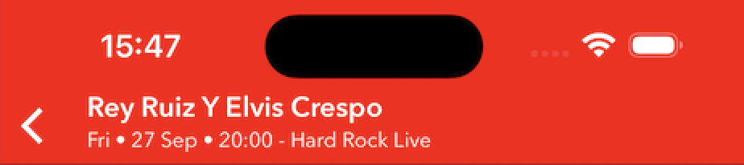 |
| `EVENT_INFO`    | Show only the event info button |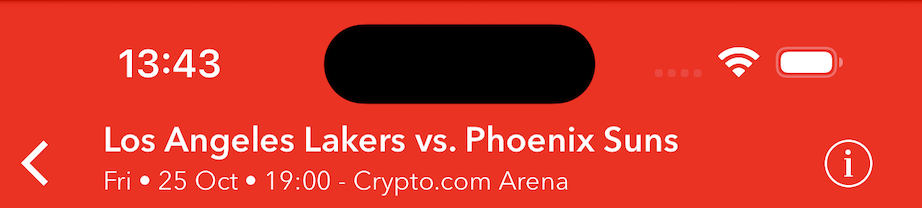|
| `EVENT_SHARE`   | Show only the event share button   |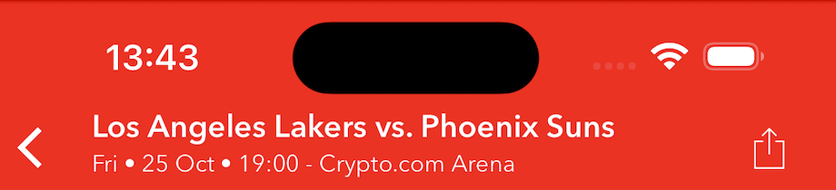|
| `EVENT_INFO_SHARE`    | Show both the info and share buttons   |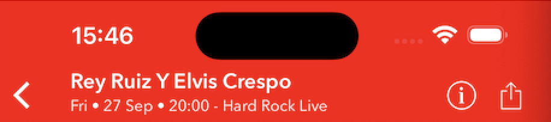|

The info icon in the Purchase SDK navigation header for Android is no longer configurable. `EVENT_INFO` and `EVENT_INFO_SHARE` will not affect it and the button shows up within the WebView of the EDP page itself on the suitable pages.

##### The `autoUpdate` prop 

`autoUpdate` is a prop that can be set to `false` to prevent `IgniteProvider` from rerendering your app when the auth state changes, as you may want to update and maintain this state with your own logic. (⚠️ warning: if set to `false`, `authState`'s `isLoggedIn`, `memberInfo` and `isConfigured` will not automatically update so will be unavailable for your app and you will have to call `getMemberInfo`, `getIsLoggedIn` and use `IgniteAnalytics` manually to retrieve auth states and data for your app. The default value is `true`. See more on `authState` later on.)

```typescript
import { IgniteProvider } from 'react-native-ticketmaster-ignite';

<IgniteProvider
  options={{
    apiKey: API_KEY,
    clientName: CLIENT_NAME,
    primaryColor: PRIMARY_COLOR
  }}
  autoUpdate={false}
>
    <App />
</IgniteProvider>
```

#### useIgnite

To handle authentication in a React Native app you can either use the `AccountsSdk` module detailed in the next section or you can use the `useIgnite` hook.

The `useIgnite` hook implements all of the native Accounts SDK methods for easy out of the box use in a React Native apps. It also provides `isLoggingIn` and an `authState` object with properties `isLoggedIn`, `memberInfo` and `isConfigured`, these properties update themselves during and after authenticaion.

Once the user authenticates `isLoggedIn` will remain true after app restarts. On the initial render, `isLoggedIn` is `false` and is updated to `true` when the login state is retrieved from the native SDK's. To avoid an incorrect logged out state on the first render, on your apps home screens you can hide sign in text/UI or use an `<ActivityIndicator />`/loading UI in that area of the screen while `isConfigured` is false. 

`isConfigured` becomes true after the Accounts SDK has successfully configured and the local storage `isLoggedIn` value and `memberInfo` response data have both been retrieved by the SDK. This makes it useful to condition against any API calls which require OAuth tokens or any UI buttons that trigger Ignite SDK views and methods, as if the Accounts SDK does not configure, auth will not work in any of the SDK's and API calls that require OAuth tokens will fail.

Example:

```tsx
import { ActivityIndicator, Text } from 'react-native';
import { useIgnite } from 'react-native-ticketmaster-ignite';

const {
  login,
  logout,
  logoutAll,
  getToken,
  getMemberInfo,
  getIsLoggedIn,
  isLoggingIn,
  refreshToken,
  refreshConfiguration,
  authState: { isLoggedIn, memberInfo, isConfigured },
} = useIgnite();

try {
  await login();
} catch (e) {
  console.log('Accounts SDK login error:', (e as Error).message);
}

{
  isLoggingIn && (
    <View style={styles.activityIndicator}>
      <ActivityIndicator color={'blue'} size={'small'} />
    </View>
  );
}

{isLoggedIn && <Text>You are logged in<Text/>}
```

##### Login/Logout Callbacks

The `login()` method from the `useIgnite` hook accepts an object with properties `onLogin` and `skipUpdate`:

- `onLogin` - a callback that fires after successful authentication
- `skipUpdate` - Set value to `true` to prevent a rerender after successful authentication (⚠️ warning: if set to `true`, `isLoggedIn`, `isLoggingIn` and `memberInfo` will not automatically update and you will have to call `getMemberInfo` and `getIsLoggedIn` manually. It's recommended you implement AccountsSDK directly and not use this hook if you want complete control of React Native screen and state updates. The default value is `false`.)

Example:

```tsx
import { ActivityIndicator } from 'react-native';
import { useIgnite } from 'react-native-ticketmaster-ignite';

const { login } = useIgnite();

const callback = () => {
  console.log('User logged in');
};

try {
  // If skipUpdate is not provided its default value is false
  await login({ onLogin: callback, skipUpdate: false });
} catch (e) {
  console.log('Accounts SDK login error:', (e as Error).message);
}
```

`logout()`/`logoutAll()` accepts a similar object here are the shapes below:

```typescript
type LoginParams = {
  onLogin?: () => void;
  skipUpdate?: boolean;
};

type LogoutParams = {
  onLogout?: () => void;
  skipUpdate?: boolean;
};
```

#### AccountsSdk

Exposes the following functions:

- `configureAccountsSDK` - Called in `IgniteProvider` before `<App />` is mounted, generally no need to implement this method manually. 
- `login`
- `logout`
- `logoutAll`
- `refreshToken`
- `getMemberInfo`
- `getToken`
- `isLoggedIn`

It is advised you use auth methods from `useIgnite()` in the above section instead of using the AccountsSdk module directly, as all hook variables like `isLoggedIn` and `memberInfo` will be updated automatically, re-render your application and methods and variables from the hook are dependency array safe for React hooks. 


#### Refresh Token

The Accounts SDK only returns an access token, not a refresh token. If the user is logged in and `getToken()` ever returns `null`, the refresh token may have expired. In this situation you can either call `logout()` so the user can manually login again to refresh the refresh token and receive a new access token or you can call `refreshToken()` which will automatically present the login UI to the user (you must use `useIgnite`'s `refreshToken()` method to trigger this behaviour on Android). If you do not need to use an OAuth access token from the Accounts SDK, you typically do not need to worry about this and can rely on `isLoggedIn` from `useIgnite()` to control your login UI state.

On recent versions of the iOS Accounts SDK, it has been observed that on backend server errors `getToken()` and `getMemberInfo()` methods are returning `TicketmasterFoundation.ConnectionError error...` instead of `null`. In these situations, if the user has previously logged in `isLoggedIn` from `useIgnite()` will be `true`, so `isLoggedIn` is a good variable to use to control the logged in UI state of the whole application, it also works well in useEffect dep arrays. `await getIsLoggedIn()` is good to call directly after methods like `await login()` or `await refreshToken()` to check/retrieve a boolean which states if the user is logged in which can be used for your own custom variables or conditions in your business logic.

As a fail safe, it may be beneficial to call `refreshToken()` **once** on the first log occurrence of `TicketmasterFoundation.ConnectionError error...` being logged a catch block, in case the user just needs to re-authenticate, but a backend server error should resolve itself after a short period of time (within 5 mins) so a "something went wrong, please try again later" error message to the user may suffice on an occurrence of this error.

To catch `TicketmasterFoundation.ConnectionError error 0` logs on app launch see [here](https://github.com/ticketmaster/react-native-ticketmaster-ignite?tab=readme-ov-file#reconfigure-accounts-sdk)

#### Reconfigure Accounts SDK

If you want to switch between different API keys within one app session/during runtime, you can call the `refreshConfiguration` method provided by the `useIgnite()` hook. This will also update the API configuration for the Tickets and Retail SDK's if your application uses them. When a user switches API key, they must login once, on newer version of the Ignite SDK's the login screen pops up and the user will SSO into the new configuration, but login always has to be called once. This method automatically calls login after reconfiguration of a new key, see below params on how to skip auto login in case you want to call login yourself.

`refreshConfiguration()` calls `configureAccountsSDK()` so it can also be used for general Accounts SDK configuration/if the initial `configureAccountsSDK()` done by `<IgniteProvider/>` ever fails in your app.

Example:

```tsx
import { useIgnite } from 'react-native-ticketmaster-ignite';

try {
  await refreshConfiguration({
    apiKey: 'someApiKey',
    clientName: 'Team 2',
    primaryColor: '#FF0000',
  });
} catch (e) {
  console.log('Account SDK refresh configuration error:', (e as Error).message);
}
```

The `refreshConfiguration()` method from the `useIgnite` accepts the below list of properties (apiKey is the only compulsory param):

- `apiKey` - An API configuration key from your Ticketmaster developer account
- `clientName` - Company name 
- `primaryColor` - Company brand color
- `region` - Server deployment region
- `marketDomain` - Country for Retail SDK configuration
- `eventHeaderType` - Tools that will be available in the navigation header of the Purchase SDK
- `onSuccess` - a callback that fires after successful Accounts SDK configuration
- `onLoginSuccess` - a callback that fires after successful login. `login()` is called automatically by `refreshConfiguration()` after it configures the SDK's.
- `skipAutoLogin` - Set value to `true` to prevent automatic login after Account SDK configuration, users will need to enter their username and password the first time they login after switching to a new API key configuration. The default value is false. See [here](https://ignite.ticketmaster.com/v1/docs/switching-teams-without-logging-out) for more information about switching between multiple API keys within one app session.
- `skipUpdate` - Set value to `true` to prevent a rerender after successful authentication (⚠️ warning: if set to `true`, `isLoggedIn`, `isLoggingIn` and `memberInfo` will not automatically update and you will have to call `getMemberInfo` and `getIsLoggedIn` manually. It's recommended you implement AccountsSDK directly and not use this hook if you want complete control of React Native screen and state updates. The default value is `false`.)

Here are the types:

```typescript
type RefreshConfigParams = {
  apiKey: string;
  clientName?: string;
  primaryColor?: string;
  region?: Region;
  marketDomain?: MarketDomain;
  eventHeaderType?: EventHeaderType;
  skipAutoLogin?: boolean;
  skipUpdate?: boolean;
  onSuccess?: () => void;
  onLoginSuccess?: () => void;
};
```

`IgniteProvider` always requires an API key so make sure you have set a default/fallback for app launch. This library does not persist API keys, so you will need to persist the users previous team selection to make sure the correct API key is used after app restarts.

A user must login once the first time the app switches to a new API key so `login()` is called automatically by `refreshConfiguration()` after it configures the SDK's. To prevent this set `skipAutoLogin` to true, but `login()` will need to be called before the user can perform any authenticiated flows within the SDK's or receive auth data like access tokens.

`isConfigured` being false during the initial user interactions with the UI is an indication that the initial `configureAccountsSDK()` done by `<IgniteProvider/>` has failed. You can either assess its value on initial user interaction or call `refreshConfiguration()` on mount manually, if you end up experiencing issues with the automatic Accounts SDK configuration this library does. Usually the initial call to the library works completely fine.

Example using `refreshConfiguration()` as the initial method to configure the SDK's:

Inside one of your child components of `IgniteProvider`

```tsx
import { useIgnite } from 'react-native-ticketmaster-ignite';

  const {
    refreshConfiguration,
    authState: {isConfigured}
  } = useIgnite()

  useEffect(() => {
    const configureIgniteSdks = async () => {
      if (!isConfigured) {
        try {
          await refreshConfiguration({
            apiKey: 'someApiKey',
            clientName: 'Team 2',
            primaryColor: '#FF0000'
          })
        } catch (e) {
          console.log(
            'Account SDK refresh configuration error:',
            (e as Error).message
          )
        }
      }
    }
    configureIgniteSdks()
  }, [isConfigured, refreshConfiguration])

```

#### Switching Teams

You can switch teams using the `refreshConfiguration()` method mentioned above. 

##### Logout All

iOS `logout()` only logs out of the currently configured API key. If you have multiple teams in your app and you would like to logout of all teams at once, you can **replace** `logout()` with `logoutAll()` in your code. Android's `logout()` always logs out of all teams `logoutAll()` is fine to use for Android as well but there will be no difference in behaviour.

`logoutAll()` is only useful if your app has multiple teams/API keys within one app.

### TicketsSdkEmbedded

```typescript

import { TicketsSdkEmbedded } from 'react-native-ticketmaster-ignite';

return <TicketsSdkEmbedded style={{ width: '100%', height: '100%' }} />;
```

As the button navigation bottoms can differ on Android and iOS, `Dimensions` from React Native can be used to calculate a dynamic height for both platforms.

```typescript
const ticketsWindowHeight = Dimensions.get('window').height - 150

 <TicketsSdkEmbedded style={height: ticketsWindowHeight, width: '100%'} />
```

If you do not send a style prop, `{width: '100%', height: '100%'}` is used by default:

```typescript
 <TicketsSdkEmbedded />
```

If you want to force the `<TicketsSdkEmbedded />` component to carry out a fresh call on focus or after navigation to that tab/screen, you can add the below to any screen that renders the `<TicketsSdkEmbedded />` component to perform an unmount on blur behaviour (React Navigation example):

```typescript
const isFocused = useIsFocused();

if (!isFocused) {
  return null;
}

return <TicketsSdkEmbedded />;
```


React Native New Architecture + React Navigation note: There is a bug with android native UI views when New Architecture mode is switched on where the native UI does not take into account the header height from React Navigation. If this happens in your app you can use the `offsetTop` prop to add offset to the top of the native UI.

⚠️ Please note that the `offsetTop` prop only affects Android.

You can explicitly set your navigation header height to the same value as the `offsetTop` prop.

Example:

```typescript
const [offSetTop, setOffSetTop] = useState(0);

useEffect(() => {
  setOffSetTop(100);
}, []);

return <TicketsSdkEmbedded style={{width: '100%', height: '95%'}} offsetTop={offSetTop} />;
```

## TicketsSdkEmbedded with a RN custom login screen 

The Tickets SDK has it's own login screen. `isLoggedIn` from `useIgnite()` is the Accounts SDK value and on v4 of this library `isLoggedIn` can become true much quicker than the Tickets SDK default login screen dismisses. If you want to show your own custom login screen above the SDK default screen you will have to handle any delays in this UI transition yourself. You can do this with a loading screen/screen transition or a persisted custom var. Below is an example of a persisted custom var:


```typescript
const {
    authState: {isLoggedIn}
  } = useIgnite()
const isTicketsSdkLoggedIn = useSelector(isTicketsSdkLoggedInSelector)

useEffect(() => {
  if (isLoggedIn) {
    setTimeout(() => dispatch(setIsTicketsSdkLoggedIn(true)), 500)
  } else {
    dispatch(setIsTicketsSdkLoggedIn(false))
  }
}, [dispatch, isLoggedIn])

return (
  <>
    {isTicketsSdkLoggedIn ? (
        <TicketsSdkEmbedded
          style={{height: ticketsWindowHeight, width: '100%'}}
        />
 ...
```
You will need to persist the custom variable using a local storage library/tool of your choice.

### TicketsSdkModal (iOS only)

TicketsSdkModal returns `null` on Android

Example:

```typescript
import { Platform, Pressable, Text } from 'react-native';
import { TicketsSdkModal } from 'react-native-ticketmaster-ignite';

const onShowTicketsSdkModal = () => {
    Platform.OS === 'ios' && TicketsSdkModal?.showTicketsSdkModal();
};

return (
  <>
    {Platform.OS === 'ios' && (
      <Pressable onPress={() => onShowTicketsSdkModal()}>
        <Text>Show Tickets SDK Modal</Text>
      </Pressable>
    )}
  </>
);

```

### Ticket Deep Links

You can call `setTicketDeepLink()` to setup a deep link to an order by passing the method an order or event ID.

Example:

```typescript
const { setTicketDeepLink } = useIgnite();

setTicketDeepLink('TICKET_ORDER_OR_EVENT_ID')
```

You can then navigate to the component/screen which renders the Tickets SDK and the order with the order ID set will show above the My Tickets SDK view.

If you want to do multiple deep links to the `<TicketsSdkEmbedded />` component within an app session without the user closing the app, you will need to do an unmount on blur approach on the RN screen that renders the Tickets SDK component and once the user or your code navigates back to that screen the ticket with that order/event ID will pop up, as the deep link is triggered after the Tickets SDK mounts.

To achieve this with React Navigation, you can add the below to any screen that renders the `<TicketsSdkEmbedded />` component:

```typescript
const isFocused = useIsFocused();

if (!isFocused) {
  return null;
}

return <TicketsSdkEmbedded />;
```

You can also create your own global state variables to unmount the screen with logic similar to the above and React Navigation also provides a layout prop where you can wrap a screen with a component that contains your custom logic. See more [here](https://reactnavigation.org/docs/upgrading-from-6.x/#the-unmountonblur-option-is-removed-in-favor-of-poptotoponblur-in-bottom-tab-navigator-and-drawer-navigator)

### Secure Entry View

Replace `SECURE_ENTRY_TOKEN` with a token for a secure entry barcode.

Example:

```typescript

import { SecureEntry } from 'react-native-ticketmaster-ignite';

<View>
  <SecureEntry token="SECURE_ENTRY_TOKEN" style={{ width: '100%', height: '100%'}} />
</View>
```


React Native New Architecture + React Navigation note: There is a bug with android native UI views when New Architecture mode is switched on where the native UI does not take into account the header height from React Navigation. If this happens in your app you can use the `offsetTop` prop to add offset to the top of the native UI.

⚠️ Please note that the `offsetTop` prop only affects Android.

Example: 
```typescript
return <SecureEntry token="SECURE_ENTRY_TOKEN" style={{top: '30%', height: 300, width: '70%', alignSelf: 'center',}} offsetTop={100}/>
```

### RetailSdk

Module responsible for the purchase and pre-purchase flows in the Retail SDK.

##### Purchase SDK

Purchase flow (also known as Events Details Page/EDP - see more [here](https://ignite.ticketmaster.com/v1/docs/events-detail-page-edp)) should be used for buying single events by their ID's.

Example:

```typescript
import { RetailSdk } from 'react-native-ticketmaster-ignite';

const onShowPurchase = async () => {
  RetailSdk.presentPurchase(DEMO_EVENT_ID);
};
```

##### PrePurchase SDK - Venue

The venue prepurchase flow (also known as Venue Details Page/VDP - see more [here](https://ignite.ticketmaster.com/v1/docs/venue-detail-page-vdp)) should be used for showing events for a particular venue. From there, the user will be able to progress with a selected event into the purchase flow.

Example:

```typescript
import { RetailSdk } from 'react-native-ticketmaster-ignite';

const onShowPrePurchaseVenue = async () => {
  RetailSdk.presentPrePurchaseVenue(DEMO_VENUE_ID);
};
```

##### PrePurchase SDK - Attraction

The attraction prepurchase flow (also known as Attraction Details Page/ADP - see more [here](https://ignite.ticketmaster.com/docs/attraction-detail-page-adp)) should be used for showing events for a particular attraction, eg. a sports team or musicial. From there, the user will be able to progress with a selected event into the purchase flow.

Example:

```typescript
import { RetailSdk } from 'react-native-ticketmaster-ignite';

const onShowPrePurchaseAttraction = async () => {
  RetailSdk.presentPrePurchaseAttraction(DEMO_ATTRACTION_ID);
};
```

##### Discovery API

To get data from the discovery API you can call the API directly in your app. To learn more about the Discovery API see [here](https://developer.ticketmaster.com/products-and-docs/apis/discovery-api/v2/).

```typescript
const attractionIds = ['K8vZ9171o57', 'K8vZ91718XV'].join(',');

useEffect(() => {
  fetch(
    `https://app.ticketmaster.com/discovery/v2/events.json?attractionId=${attractionIds}&sort=date,asc&page=${page}&locale=en-us&apikey=${apiKey}` 
  )
    .then((response) => response.json())
    .then((data) => {
      console.log(data._embedded.attractions);
    });
}, [attractionIds, page, apiKey]);
```

### Prebuilt Modules

To use prebuilt modules, `IgniteProvider` has a `prebuiltModules` prop which accepts the following object:

```typescript
<IgniteProvider
  options={{
    apiKey: API_KEY,
    clientName: CLIENT_NAME,
    primaryColor: PRIMARY_COLOR
  }}
  prebuiltModules={{
    moreTicketActionsModule: {
      enabled: true,
    },
    venueDirectionsModule: {
      enabled: true,
    },
    seatUpgradesModule: {
      enabled: true,
      topLabelText: "test top label", // not required
      bottomLabelText: "test bottom label", // not required
      image: require('../assets/seatUpgradesOverride.png'), // not required
    },
    venueConcessionsModule: {
      enabled: true,
      orderButtonCallback: () => {},
      walletButtonCallback: () => {},
      topLabelText: "test top label", // not required
      bottomLabelText: "test bottom label", // not required
      image: require('../assets/venueConcessionsOverride.png'), // not required
    },
    invoiceModule: {
      enabled: true,
    },
  }}
>
    <App />
</IgniteProvider>
```

You only need to provide the prebuilt modules you want to display to `prebuiltModules`. Any module omitted will be set to `enabled: false` by default.
Here is an example of only showing the Venue Directions Module:

```typescript
 prebuiltModules={{
    venueDirectionsModule: {
      enabled: true,
    },
  }}
```

To learn more about Prebuilt Modules see [here](https://ignite.ticketmaster.com/docs/modules-overview). 

#### Customising Prebuilt Modules

The `seatUpgradesModule` and `venueConcessionsModule` can be further customised - you can select the custom labels and images for both sections.

##### Custom Labels

You can: 
- Pass custom `topLabelText` and/or `bottomLabelText` to display a custom text
- Pass empty strings in `topLabelText` and/or `topLabelText` to hide the labels
- Omit `topLabelText` and/or `topLabelText` to show their default values

On Android you can only customise the `topLabelText` for `seatUpgradesModule`. If you pass custom `bottomLabelText` it will only be used on iOS. See the example use cases below. 

##### Custom Images

You can select custom images for `seatUpgradesModule` and `venueConcessionsModule` by pulling the image with `require()` and passing it as a prop. The example app included in this library uses custom images to demo the usage. 

| Platform | Default view | Custom view | Empty strings |
|----------|----------|----------|----------|
| ios    | 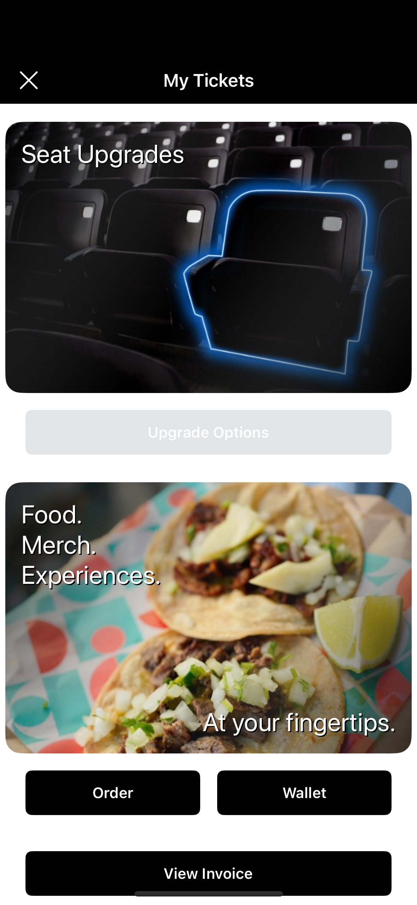   | 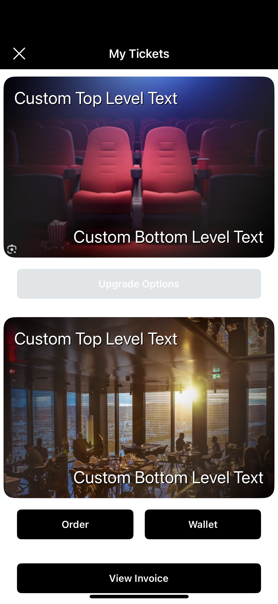   |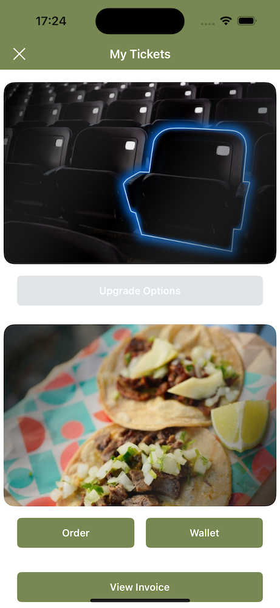   |
| android    |    | 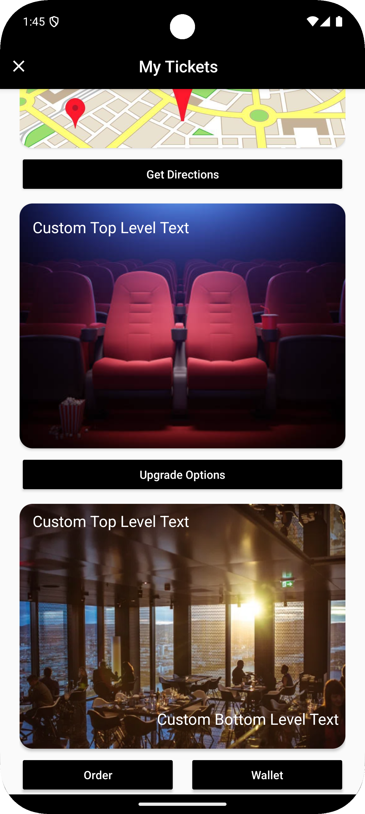   |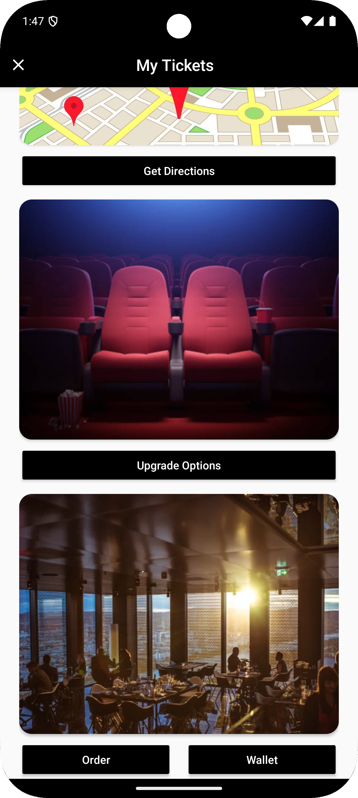   |

### Custom Modules

You can configure up to 3 buttons as a custom module. Each button accepts a callback function. An optional `headerView` can be displayed above the buttons — either a solid color, a bundled image via `require()`, or a remote image via `{ uri: '...' }`.

```typescript
<IgniteProvider
  options={{
    apiKey: API_KEY,
    clientName: CLIENT_NAME,
    primaryColor: PRIMARY_COLOR
  }}
  customModules={{
    headerView: {
      image: require('./assets/my_module_header.png'),
    },
    button1: {
      enabled: true,
      title: 'My Button 1',
      callback: () => console.log('Button 1 called!'),
    },
    button2: {
      enabled: true,
      title: 'My Button 2',
      callback: () => console.log('Button 2 called!'),
    },
    button3: {
      enabled: true,
      title: 'My Button 3',
      callback: () => console.log('Button 3 called!'),
    },
  }}
>
  <App />
</IgniteProvider>
```

`headerView` accepts a bundled image, a remote image, or a solid color:

```typescript
// Bundled image (use require() — Metro resolves the asset at build time)
headerView: { image: require('./assets/my_module_header.png') }

// Remote image (pass an object with a `uri`)
headerView: {
  image: {
    uri: 'https://www.example.com/path/to/my_module_header.png',
  },
}

// Solid color header
headerView: { color: '#026cdf' }
```

Single button example:

```typescript
<IgniteProvider
  options={{
    apiKey: API_KEY,
    clientName: CLIENT_NAME,
    primaryColor: PRIMARY_COLOR
  }}
  customModules={{
    button1: {
      enabled: true,
      title: 'My Button 1',
      callback: () => console.log('Button 1 called!'),
    },
  }}
>
  <App />
</IgniteProvider>
```

| iOS    | Android|
| ------ | ------ |
|   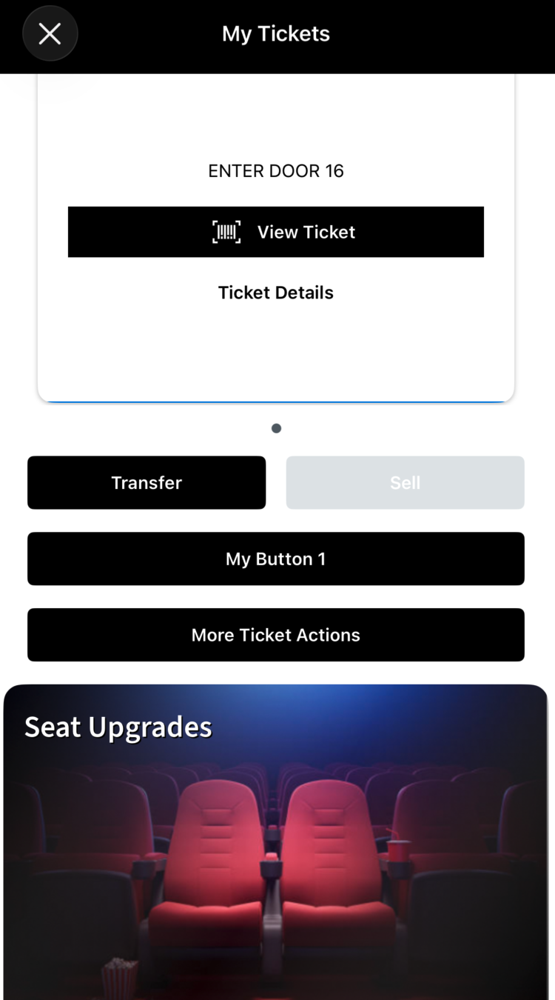     |   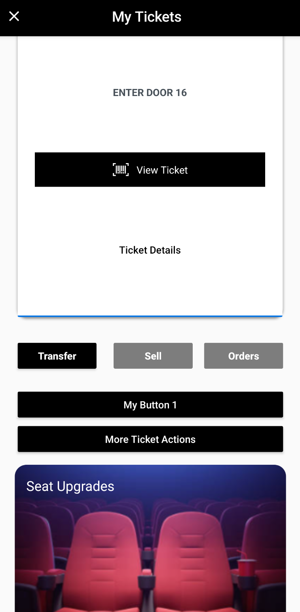     |
|   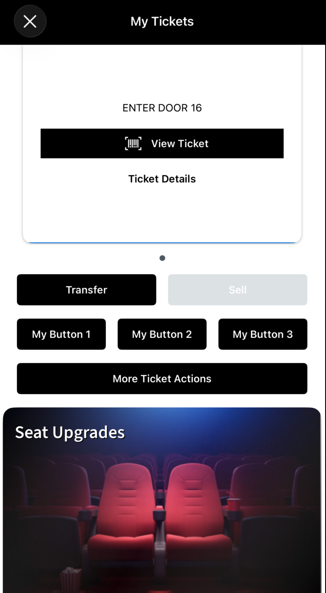     |    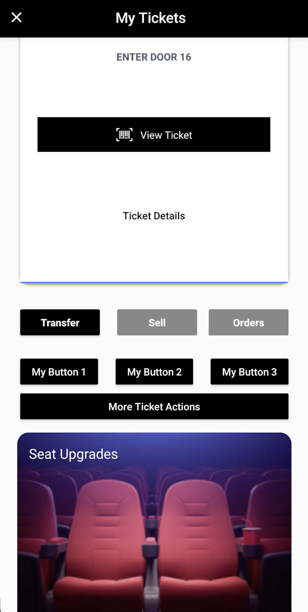    |

#### Opening a URL from a button

Use React Native's `Linking` API in the `callback` to open an external URL when a custom button is tapped:

```typescript
import { Linking } from 'react-native';

<IgniteProvider
  options={{
    apiKey: API_KEY,
    clientName: CLIENT_NAME,
    primaryColor: PRIMARY_COLOR
  }}
  customModules={{
    button1: {
      enabled: true,
      title: 'Visit Ticketmaster',
      callback: () => Linking.openURL('https://www.ticketmaster.com'),
    },
  }}
>
  <App />
</IgniteProvider>
```

### Analytics

You can send a callback method to `IgniteProvider` to receive Ignite SDK analytics in your app which you can then send off to your chosen analytics service.

To see the full list of available analytics in this library see: [Analytics](./docs/analytics.md)

```typescript
import { IgniteProvider, IgniteAnalytics, IgniteAnalyticName } from 'react-native-ticketmaster-ignite';

const igniteAnalytics = async (data: IgniteAnalytics) => {
    const key = Object.keys(data)[0];
    switch (key) {
      case IgniteAnalyticName.PURCHASE_SDK_DID_BEGIN_TICKET_SELECTION_FOR:
        console.log(
          'EDP started for',
          data.purchaseSdkDidBeginTicketSelectionFor.eventName
        );
    }
  };

<IgniteProvider
  options={{
    apiKey: API_KEY,
    clientName: CLIENT_NAME,
    primaryColor: PRIMARY_COLOR
  }}
  analytics={igniteAnalytics}
>
    <App />
</IgniteProvider>
```

#### Navigate to a Tickets Tab after purchase

This example uses [React Navigation](https://reactnavigation.org/docs/6.x/navigating-without-navigation-prop) and Redux Toolkit, you'll have to replace those code lines with your chosen navigation and state management methods.

```typescript
import {
  IgniteAnalytics,
  IgniteAnalyticName,
} from 'react-native-ticketmaster-ignite';
import * as RootNavigation from './RootNavigation';
import { store } from '../redux/store';
import { setExampleValue } from '../redux/slices/example';

const igniteAnalytics = async (data: IgniteAnalytics) => {
  const key = Object.keys(data)[0];
  switch (key) {
    // iOS
    case IgniteAnalyticName.PURCHASE_SDK_DID_END_CHECKOUT_FOR:
      if (
        data.purchaseSdkDidEndCheckoutFor.reason === 'userCompletedPurchase'
      ) {
        store.dispatch(setExampleValue('Random Value')); // Example - Not needed for navigation
        RootNavigation.navigate('BottomTabs', {
          screen: 'MY TICKETS',
        });
      }
      break;
    // Android
    case IgniteAnalyticName.PURCHASE_SDK_MANAGE_MY_TICKETS:
      RootNavigation.navigate('BottomTabs', {
        screen: 'MY TICKETS',
      });
      break;
  }
};
```

### Debugging/Logging

To turn on useful logging to inspect data and for debugging you can turn on logging by passing `true` to the `enableLogs` prop on `IgniteProvider`

```typescript
<IgniteProvider enableLogs={true}>
  <App />
</IgniteProvider>
```

Or use callbacks/exceptions/analytics/returned method data to create your own debug logs

Example Accounts SDK configuration callback log example:

```typescript
  const { refreshConfiguration } = useIgnite()

const onConfigurationSuccess = () =>
  console.log('Accounts SDK configuration successful');

 useEffect(() => {
    const configureIgniteSdks = async () => {
      try {
        await refreshConfiguration({
          apiKey: 'someApiKey',
          clientName: 'Team 2',
          primaryColor: '#FF0000',
          onSuccess: onConfigurationSuccess,
        })
      } catch (e) {
        console.log(
          'Account SDK refresh configuration error:',
          (e as Error).message
        )
      }
    }
    configureIgniteSdks()
  }, [refreshConfiguration])
```


As the initial Accounts SDK configuration is done for your app via `IgniteProvider`, any failures in this process will still be logged, as if the Accounts SDK configuration fails then none of the Ignite SDK's will work in your application.


On any logs of `TicketmasterFoundation.ConnectionError error` see [here](https://github.com/ticketmaster/react-native-ticketmaster-ignite?tab=readme-ov-file#refresh-token)


</details>

<details>
<summary><h2 style="display:inline-block">Running the demo apps</h2></summary>

To run the React Native example app:

Clone the project and then

```bash
cd react-native-ticketmaster-ignite
yarn
cd example/ios
pod install
yarn start
```
Then run the project with either `yarn android`/`yarn ios` or building the app in Android Studio/Xcode.

To run the Expo app: 
Clone the project and then

```bash
cd react-native-ticketmaster-ignite
yarn
cd expo
```
Then run the project with either `yarn expo:android`/`yarn expo:ios`


</details>

<details>
<summary><h2 style="display:inline-block">Environment variables</h2></summary>

In order to use the library, setup a developer account with Ticketmaster by contacting nexus_sdk@ticketmaster.com.

For the Retail SDK (PrePurchase and Purchase) views, you will need to be provided with your own attraction or venue ID's for events and venue, representatives from nexus_sdk@ticketmaster.com should be able to help with this. For the purpose of initial testing you can use the below.


Replace "someApiKey" with the API keys from your Ticketmaster Developer Account. (iOS and Android need different API keys, see the example at the end of this section)
Replace "clientName" with your company name, for example "My Company Name". You can set this in the `options` prop of `<IgniteProvider>`.
Replace "#026cdf" with the main color theme of your app.


If running in the `example` app you can create a `.env` in `/example` with the values below or update the codebase with your desired values.

```bash
API_KEY=someApiKey
CLIENT_NAME=clientName
PRIMARY_COLOR=#000000
DEMO_EVENT_ID=0C00630DE7294188
DEMO_ATTRACTION_ID=2873404
DEMO_VENUE_ID=KovZpZAEdntA
```

If running the `expo` app then inside `/expo` you can create a `.env` and add:
```bash
EXPO_PUBLIC_API_KEY=someApiKey
EXPO_PUBLIC_CLIENT_NAME=clientName
EXPO_PUBLIC_PRIMARY_COLOR=000000
EXPO_PUBLIC_DEMO_EVENT_ID=0C00630DE7294188
EXPO_PUBLIC_DEMO_ATTRACTION_ID=2873404
EXPO_PUBLIC_DEMO_VENUE_ID=KovZpZAEdntA
```

You need to use a different key for iOS and Android, you can make the value for API_KEY and object `API_KEY={KeyName_ios: abcde, KeyName_android: abcdefg}` and in your RN code you can use `Platform.OS` to select the right KeyName to pass to the SDK. Example:


Library choice for environment variables is optional

```typescript
import Config from 'react-native-config'

const apiKeyJson = JSON.parse(Config.API_KEY)

<IgniteProvider
  options={{
   apiKey:
    apiKeyJson[`KeyName_${Platform.OS}`] || '',
...
```

Note: If you change the API key in an .env for iOS you may need to **Product** > **Clean Build Folder** for the change to take affect.
