### User Guide

`react-native-ticketmaster-ignite` exports the following modules:

- `IgniteProvider`
- `AccountsSdk`
- `TicketsSdkModal` (iOS only)
- `TicketsSdkEmbedded`
- `RetailSdk`
- `useIgnite`

#### IgniteProvider

This is the only module that must be implemented for the library to work correctly. The purpose of `IgniteProvider` is to pass the config `options` to the native code.

Required props in `options` are:

- `apiKey`
- `clientName`
- `primaryColor`

Optional props in `options` are: 
- `region`
- `marketDomain`
- `eventHeaderType`

In order to use it, wrap your application with the `IgniteProvider` and pass the API key and client name as a prop:

```typescript
import { IgniteProvider } from 'react-native-ticketmaster-ignite';

<IgniteProvider
  options={{
    apiKey: API_KEY,
    clientName: CLIENT_NAME,
    primaryColor: PRIMARY_COLOR
  }}
>
    <App />
</IgniteProvider>
```

##### The `region` property

The `region` property determines the server deployment region the SDK's will connect to. The values can be either `US` or `UK`. The default value is `US` and should be used unless you have specifically been told to set your region to `UK`.

Generally places within the United States, Canada, Australia, and New Zealand should set the server region to `US` and places/countries within the UK, Ireland, Europe, Middle East and South Africa need to set the server region to `UK`.

##### The `marketDomain` property
The `marketDomain` property is used to configure the country that the Retail SDK needs to retrieve attractions, venues and events for. The default value is `US`

See [here](./marketDomains.md) for the list of supported market domains.

##### The `eventHeaderType` property 

The `eventHeaderType` property accepts one of the following values - `NO_TOOLBARS`, `EVENT_INFO`, `EVENT_SHARE` and `EVENT_INFO_SHARE`. When the property has not been passed, the `IgniteProvider` will default to `EVENT_INFO_SHARE`. 

The `eventHeaderType` property specifies what tools will be available in the navigation header of the Purchase SDK:

| Property | Explanation | Demo |
|----------|----------|----------|
| `NO_TOOLBARS`    | Show no toolbars in Event's header   | 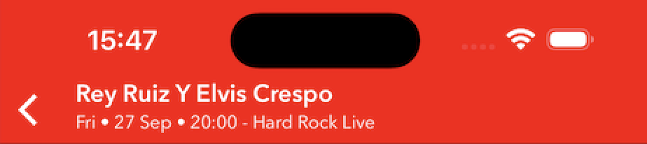 |
| `EVENT_INFO`    | Show only the event info button |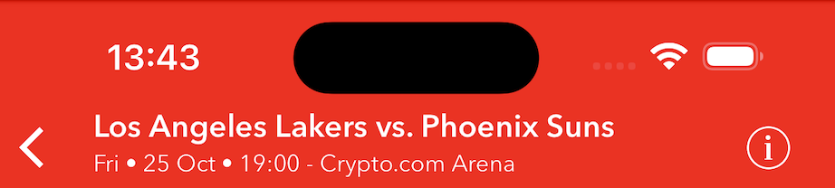|
| `EVENT_SHARE`   | Show only the event share button   |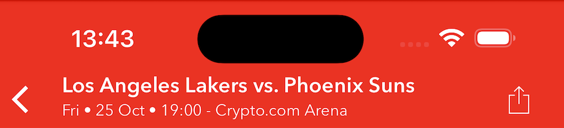|
| `EVENT_INFO_SHARE`    | Show both the info and share buttons   |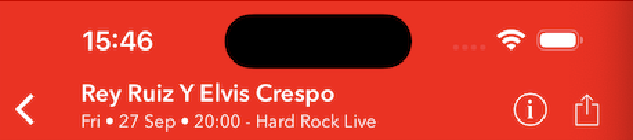|

The info icon in the Purchase SDK navigation header for Android is no longer configurable. `EVENT_INFO` and `EVENT_INFO_SHARE` will not affect it and the button shows up within the WebView of the EDP page itself on the suitable pages.

##### The `autoUpdate` prop 

`autoUpdate` is a prop that can be set to `false` to prevent `IgniteProvider` from rerendering your app when the auth state changes, as you may want to update and maintain this state with your own logic. (⚠️ warning: if set to `false`, `authState`'s `isLoggedIn`, `memberInfo` and `isConfigured` will not automatically update so will be unavailable for your app and you will have to call `getMemberInfo`, `getIsLoggedIn` and use `IgniteAnalytics` manually to retrieve auth states and data for your app. The default value is `true`. See more on `authState` later on.)

```typescript
import { IgniteProvider } from 'react-native-ticketmaster-ignite';

<IgniteProvider
  options={{
    apiKey: API_KEY,
    clientName: CLIENT_NAME,
    primaryColor: PRIMARY_COLOR
  }}
  autoUpdate={false}
>
    <App />
</IgniteProvider>
```

#### useIgnite

To handle authentication in a React Native app you can either use the `AccountsSdk` module detailed in the next section or you can use the `useIgnite` hook.

The `useIgnite` hook implements all of the native Accounts SDK methods for easy out of the box use in a React Native apps. It also provides `isLoggingIn` and an `authState` object with properties `isLoggedIn`, `memberInfo` and `isConfigured`, these properties update themselves during and after authenticaion.

Once the user authenticates `isLoggedIn` will remain true after app restarts. On the initial render, `isLoggedIn` is `false` and is updated to `true` when the login state is retrieved from the native SDK's. To avoid an incorrect logged out state on the first render, on your apps home screens you can hide sign in text/UI or use an `<ActivityIndicator />`/loading UI in that area of the screen while `isConfigured` is false. 

`isConfigured` becomes true after the Accounts SDK has successfully configured and the local storage `isLoggedIn` value and `memberInfo` response data have both been retrieved by the SDK. This makes it useful to condition against any API calls which require OAuth tokens or any UI buttons that trigger Ignite SDK views and methods, as if the Accounts SDK does not configure, auth will not work in any of the SDK's and API calls that require OAuth tokens will fail.

Example:

```tsx
import { ActivityIndicator, Text } from 'react-native';
import { useIgnite } from 'react-native-ticketmaster-ignite';

const {
  login,
  logout,
  logoutAll,
  getToken,
  getMemberInfo,
  getIsLoggedIn,
  isLoggingIn,
  refreshToken,
  refreshConfiguration,
  authState: { isLoggedIn, memberInfo, isConfigured },
} = useIgnite();

try {
  await login();
} catch (e) {
  console.log('Accounts SDK login error:', (e as Error).message);
}

{
  isLoggingIn && (
    <View style={styles.activityIndicator}>
      <ActivityIndicator color={'blue'} size={'small'} />
    </View>
  );
}

{isLoggedIn && <Text>You are logged in<Text/>}
```

##### Login/Logout Callbacks

The `login()` method from the `useIgnite` hook accepts an object with properties `onLogin` and `skipUpdate`:

- `onLogin` - a callback that fires after successful authentication
- `skipUpdate` - Set value to `true` to prevent a rerender after successful authentication (⚠️ warning: if set to `true`, `isLoggedIn`, `isLoggingIn` and `memberInfo` will not automatically update and you will have to call `getMemberInfo` and `getIsLoggedIn` manually. It's recommended you implement AccountsSDK directly and not use this hook if you want complete control of React Native screen and state updates. The default value is `false`.)

Example:

```tsx
import { ActivityIndicator } from 'react-native';
import { useIgnite } from 'react-native-ticketmaster-ignite';

const { login } = useIgnite();

const callback = () => {
  console.log('User logged in');
};

try {
  // If skipUpdate is not provided its default value is false
  await login({ onLogin: callback, skipUpdate: false });
} catch (e) {
  console.log('Accounts SDK login error:', (e as Error).message);
}
```

`logout()`/`logoutAll()` accepts a similar object here are the shapes below:

```typescript
type LoginParams = {
  onLogin?: () => void;
  skipUpdate?: boolean;
};

type LogoutParams = {
  onLogout?: () => void;
  skipUpdate?: boolean;
};
```

#### AccountsSdk

Exposes the following functions:

- `configureAccountsSDK` - Called in `IgniteProvider` before `<App />` is mounted, generally no need to implement this method manually. 
- `login`
- `logout`
- `logoutAll`
- `refreshToken`
- `getMemberInfo`
- `getToken`
- `isLoggedIn`

It is advised you use auth methods from `useIgnite()` in the above section instead of using the AccountsSdk module directly, as all hook variables like `isLoggedIn` and `memberInfo` will be updated automatically, re-render your application and methods and variables from the hook are dependency array safe for React hooks. 


#### Refresh Token

The Accounts SDK only returns an access token, not a refresh token. If the user is logged in and `getToken()` ever returns `null`, the refresh token may have expired. In this situation you can either call `logout()` so the user can manually login again to refresh the refresh token and receive a new access token or you can call `refreshToken()` which will automatically present the login UI to the user (you must use `useIgnite`'s `refreshToken()` method to trigger this behaviour on Android). If you do not need to use an OAuth access token from the Accounts SDK, you typically do not need to worry about this and can rely on `isLoggedIn` from `useIgnite()` to control your login UI state.

On recent versions of the iOS Accounts SDK, it has been observed that on backend server errors `getToken()` and `getMemberInfo()` methods are returning `TicketmasterFoundation.ConnectionError error...` instead of `null`. In these situations, if the user has previously logged in `isLoggedIn` from `useIgnite()` will be `true`, so `isLoggedIn` is a good variable to use to control the logged in UI state of the whole application, it also works well in useEffect dep arrays. `await getIsLoggedIn()` is good to call directly after methods like `await login()` or `await refreshToken()` to check/retrieve a boolean which states if the user is logged in which can be used for your own custom variables or conditions in your business logic.

As a fail safe, it may be beneficial to call `refreshToken()` **once** on the first log occurrence of `TicketmasterFoundation.ConnectionError error...` being logged a catch block, in case the user just needs to re-authenticate, but a backend server error should resolve itself after a short period of time (within 5 mins) so a "something went wrong, please try again later" error message to the user may suffice on an occurrence of this error.

To catch `TicketmasterFoundation.ConnectionError error 0` logs on app launch see [here](https://github.com/ticketmaster/react-native-ticketmaster-ignite?tab=readme-ov-file#reconfigure-accounts-sdk)

#### Reconfigure Accounts SDK

If you want to switch between different API keys within one app session/during runtime, you can call the `refreshConfiguration` method provided by the `useIgnite()` hook. This will also update the API configuration for the Tickets and Retail SDK's if your application uses them. When a user switches API key, they must login once, on newer version of the Ignite SDK's the login screen pops up and the user will SSO into the new configuration, but login always has to be called once. This method automatically calls login after reconfiguration of a new key, see below params on how to skip auto login in case you want to call login yourself.

`refreshConfiguration()` calls `configureAccountsSDK()` so it can also be used for general Accounts SDK configuration/if the initial `configureAccountsSDK()` done by `<IgniteProvider/>` ever fails in your app.

Example:

```tsx
import { useIgnite } from 'react-native-ticketmaster-ignite';

try {
  await refreshConfiguration({
    apiKey: 'someApiKey',
    clientName: 'Team 2',
    primaryColor: '#FF0000',
  });
} catch (e) {
  console.log('Account SDK refresh configuration error:', (e as Error).message);
}
```

The `refreshConfiguration()` method from the `useIgnite` accepts the below list of properties (apiKey is the only compulsory param):

- `apiKey` - An API configuration key from your Ticketmaster developer account
- `clientName` - Company name 
- `primaryColor` - Company brand color
- `region` - Server deployment region
- `marketDomain` - Country for Retail SDK configuration
- `eventHeaderType` - Tools that will be available in the navigation header of the Purchase SDK
- `onSuccess` - a callback that fires after successful Accounts SDK configuration
- `onLoginSuccess` - a callback that fires after successful login. `login()` is called automatically by `refreshConfiguration()` after it configures the SDK's.
- `skipAutoLogin` - Set value to `true` to prevent automatic login after Account SDK configuration, users will need to enter their username and password the first time they login after switching to a new API key configuration. The default value is false. See [here](https://ignite.ticketmaster.com/v1/docs/switching-teams-without-logging-out) for more information about switching between multiple API keys within one app session.
- `skipUpdate` - Set value to `true` to prevent a rerender after successful authentication (⚠️ warning: if set to `true`, `isLoggedIn`, `isLoggingIn` and `memberInfo` will not automatically update and you will have to call `getMemberInfo` and `getIsLoggedIn` manually. It's recommended you implement AccountsSDK directly and not use this hook if you want complete control of React Native screen and state updates. The default value is `false`.)

Here are the types:

```typescript
type RefreshConfigParams = {
  apiKey: string;
  clientName?: string;
  primaryColor?: string;
  region?: Region;
  marketDomain?: MarketDomain;
  eventHeaderType?: EventHeaderType;
  skipAutoLogin?: boolean;
  skipUpdate?: boolean;
  onSuccess?: () => void;
  onLoginSuccess?: () => void;
};
```

`IgniteProvider` always requires an API key so make sure you have set a default/fallback for app launch. This library does not persist API keys, so you will need to persist the users previous team selection to make sure the correct API key is used after app restarts.

A user must login once the first time the app switches to a new API key so `login()` is called automatically by `refreshConfiguration()` after it configures the SDK's. To prevent this set `skipAutoLogin` to true, but `login()` will need to be called before the user can perform any authenticated flows within the SDK's or receive auth data like access tokens.

`isConfigured` being false during the initial user interactions with the UI is an indication that the initial `configureAccountsSDK()` done by `<IgniteProvider/>` has failed. You can either assess its value on initial user interaction or call `refreshConfiguration()` on mount manually, if you end up experiencing issues with the automatic Accounts SDK configuration this library does. Usually the initial call to the library works completely fine.

Example using `refreshConfiguration()` as the initial method to configure the SDK's:

Inside one of your child components of `IgniteProvider`

```tsx
import { useIgnite } from 'react-native-ticketmaster-ignite';

  const {
    refreshConfiguration,
    authState: {isConfigured}
  } = useIgnite()

  useEffect(() => {
    const configureIgniteSdks = async () => {
      if (!isConfigured) {
        try {
          await refreshConfiguration({
            apiKey: 'someApiKey',
            clientName: 'Team 2',
            primaryColor: '#FF0000'
          })
        } catch (e) {
          console.log(
            'Account SDK refresh configuration error:',
            (e as Error).message
          )
        }
      }
    }
    configureIgniteSdks()
  }, [isConfigured, refreshConfiguration])

```

#### Switching teams/venue (API key) during runtime

To switch teams you can use the `refreshConfiguration()` method.

```tsx
import { useIgnite } from 'react-native-ticketmaster-ignite';

  const {
    login,
    refreshConfiguration,
  } = useIgnite();

try {
  await refreshConfiguration({
    apiKey: 'someApiKey',
    clientName: 'Team 2',
    primaryColor: '#FF0000',
  });
} catch (e) {
  console.log('Account SDK refresh configuration error:', (e as Error).message);
}
```

When switching to a new API key, `refreshConfiguration()` automatically calls `login()` after configuration since users must authenticate at least once per key. Set `skipAutoLogin` to true to prevent this, but a user must be logged in to the new team or issues will arise when using the Tickets SDK. If a user has logged into 2 different teams, they can now freely switch between those 2 teams without needing to login.

To reconfigure the Tickets SDK, an unmount on blur approach needs to be done for both Android and iOS. In React Native's Fabric renderer (New Architecture), iOS views remains in memory and continues rendering even when "hidden" by React Navigation Bottom Tabs. To solve this, the `<TicketsSdkEmbedded />` component has a new prop called `isFocused` which will trigger additional logic within the `<TicketsSdkEmbedded />` component to reconfigure the iOS Tickets SDK. During team reconfiguration and login, unmount the `<TicketsSdkEmbedded />` component by navigating to a custom RN login/loading screen and after login is successful navigate back to the `<TicketsSdkEmbedded />` component.

⚠️ warning: `isFocused` must toggle from `false` to `true` to trigger the Tickets SDK refresh/reconfiguration. Navigating to another RN screen that is still within the same bottom tab screen does not always toggle `isFocused` from `false` to `true` depending on the navigation approach, so while implementing API key switching you must log the variable and ensure your approach toggles the boolean. Alternatively, you can create your own custom variable and toggle it within your JS method that calls `refreshConfiguration()`.


```typescript
import { useIsFocused } from '@react-navigation/native';

const isFocused = useIsFocused();

return (
  <TicketsSdkEmbedded
    isFocused={isFocused}
  />
);
```

Expo 

```typescript
import { useIsFocused } from 'expo-router';

const isFocused = useIsFocused();

return (
  <TicketsSdkEmbedded
    isFocused={isFocused}
  />
);
```

Currently in this library Android does not have a default login screen, so always make sure the new API key is configured and the user is logged in before you show the `<TicketsSdkEmbedded />` component.

For React Native iOS, there is currently no way to know if the user has not done the initial login for a new team, the Accounts SDK auto logs in the new team so it returns the new token and memberInfo data but the Tickets SDK will show a signed out screen if the user has not done the initial login. For iOS it would be better to not skip login with `skipAutoLogin`. If they have done the initial login for a new team, the login modals will not popup again so the user will not be disturbed. 

For Android, `getIsLoggedIn()` and `isLoggedIn` will return `false` if a user switches to a team they haven't done the inital login for, meaning the smoothest `refreshConfiguration()` experince for both platforms results in:

```tsx
import { useIgnite } from 'react-native-ticketmaster-ignite';

  const {
    login,
    getIsLoggedIn,
    refreshConfiguration,
  } = useIgnite();

try {
  await refreshConfiguration({
    apiKey: 'someApiKey',
    clientName: 'Team 2',
    primaryColor: '#FF0000',
    skipAutoLogin: Platform.OS === 'android',
  });
  if (Platform.OS === 'android' && !getIsLoggedIn()) {
    login()
  }
} catch (e) {
  console.log('Account SDK refresh configuration error:', (e as Error).message);
}
```

##### Logout All

iOS `logout()` only logs out of the currently configured API key. If you have multiple teams in your app and you would like to logout of all teams at once, you can **replace** `logout()` with `logoutAll()` in your code. Android's `logout()` always logs out of all teams `logoutAll()` is fine to use for Android as well but there will be no difference in behaviour.

`logoutAll()` is only useful if your app has multiple teams/API keys within one app.

### TicketsSdkEmbedded

```typescript

import { TicketsSdkEmbedded } from 'react-native-ticketmaster-ignite';

return <TicketsSdkEmbedded style={{ width: '100%', height: '100%' }} />;
```

As the button navigation bottoms can differ on Android and iOS, `Dimensions` from React Native can be used to calculate a dynamic height for both platforms.

```typescript
const ticketsWindowHeight = Dimensions.get('window').height - 150

 <TicketsSdkEmbedded style={height: ticketsWindowHeight, width: '100%'} />
```

If you do not send a style prop, `{width: '100%', height: '100%'}` is used by default:

```typescript
 <TicketsSdkEmbedded />
```

If you want to force the `<TicketsSdkEmbedded />` component to carry out a fresh call on focus or after navigation to that tab/screen, you can add the below to any screen that renders the `<TicketsSdkEmbedded />` component to perform an unmount on blur behaviour:

```typescript
import { useIsFocused } from '@react-navigation/native';

const isFocused = useIsFocused();

return (
  <TicketsSdkEmbedded
    isFocused={isFocused}
  />
);
```


React Native New Architecture + React Navigation note: There is a bug with android native UI views when New Architecture mode is switched on where the native UI does not take into account the header height from React Navigation. If this happens in your app you can use the `offsetTop` prop to add offset to the top of the native UI.

⚠️ Please note that the `offsetTop` prop only affects Android.

You can explicitly set your navigation header height to the same value as the `offsetTop` prop.

Example:

```typescript
const [offSetTop, setOffSetTop] = useState(0);

useEffect(() => {
  setOffSetTop(100);
}, []);

return <TicketsSdkEmbedded style={{width: '100%', height: '95%'}} offsetTop={offSetTop} />;
```

## TicketsSdkEmbedded with a RN custom login screen 

The Tickets SDK has it's own login screen. `isLoggedIn` from `useIgnite()` is the Accounts SDK value and on v4 of this library `isLoggedIn` can become true much quicker than the Tickets SDK default login screen dismisses. If you want to show your own custom login screen above the SDK default screen you will have to handle any delays in this UI transition yourself. You can do this with a loading screen/screen transition or a persisted custom var. Below is an example of a persisted custom var:


```typescript
const {
    authState: {isLoggedIn}
  } = useIgnite()
const isTicketsSdkLoggedIn = useSelector(isTicketsSdkLoggedInSelector)

useEffect(() => {
  if (isLoggedIn) {
    setTimeout(() => dispatch(setIsTicketsSdkLoggedIn(true)), 500)
  } else {
    dispatch(setIsTicketsSdkLoggedIn(false))
  }
}, [dispatch, isLoggedIn])

return (
  <>
    {isTicketsSdkLoggedIn ? (
        <TicketsSdkEmbedded
          style={{height: ticketsWindowHeight, width: '100%'}}
        />
 ...
```
You will need to persist the custom variable using a local storage library/tool of your choice.

### TicketsSdkModal (iOS only)

TicketsSdkModal returns `null` on Android

Example:

```typescript
import { Platform, Pressable, Text } from 'react-native';
import { TicketsSdkModal } from 'react-native-ticketmaster-ignite';

const onShowTicketsSdkModal = () => {
    Platform.OS === 'ios' && TicketsSdkModal?.showTicketsSdkModal();
};

return (
  <>
    {Platform.OS === 'ios' && (
      <Pressable onPress={() => onShowTicketsSdkModal()}>
        <Text>Show Tickets SDK Modal</Text>
      </Pressable>
    )}
  </>
);

```

### Ticket Deep Links

The `<TicketsSdkEmbedded />` component has a deep link prop which takes an order or event ID.
Example:

```typescript
import { useIsFocused } from '@react-navigation/native';

const isFocused = useIsFocused();
// Set the deeplink value in an earlier screen or with redux/context  before navigating to the screen rendering the Tickets SDK.
const [ticketDeepLinkId, setTicketDeepLinkId] = useState('');
const setTicketDeepLink = () => setTicketDeepLinkId('TICKET_ORDER_OR_EVENT_ID');

return <TicketsSdkEmbedded deepLinkId={isFocused ? ticketDeepLinkId : ''} />;
```

When the user or app next navigates to the screen component/screen which renders the Tickets SDK and the order with the order ID set will show above the My Tickets SDK view.

`isFocused` is needed because if you are using Bottom Tabs from React Navigation it will render the Tickets Tab after app launch as soon as a user lands on the Home Tab, so if they are already logged in the Tickets SDK would trigger their ticket to popup in a modal, unless you have unmount on blur logic in the RN screen of the Tickets Tab.

If you want to do multiple deep links to the `<TicketsSdkEmbedded />` component within an app session without the user closing the app, you will need to do an unmount on blur approach. The `<TicketsSdkEmbedded />` component receives an `isFocused` prop. You will have to send the component React Navigation's `isFocused` value or a custom screen focus boolean as in React Native's Fabric renderer (New Architecture), iOS views remains in memory and continues rendering even when "hidden" by React Navigation Bottom Tabs, so we have extra logic inside the `<TicketsSdkEmbedded />` component to remount the iOS Tickets SDK to handle subsequent deep links within an apps session after the initial deep link.

```typescript
import { useIsFocused } from '@react-navigation/native';

const isFocused = useIsFocused();
const [ticketDeepLinkId, setTicketDeepLinkId] = useState('');
const setTicketDeepLink = () => setTicketDeepLinkId('TICKET_ORDER_OR_EVENT_ID');

  useFocusEffect(
    useCallback(() => {
      return () => {
        setTicketDeepLinkId('');
      };
    }, [setTicketDeepLinkId])
  );

  return (
    <TicketsSdkEmbedded
      deepLinkId={isFocused ? ticketDeepLinkId : ''}
      isFocused={isFocused}
    />
  );

```

The useFocusEffect unmount logic is to clear the deep link ID otherwise the users ticket will pop up after each remount of the `<TicketsSdkEmbedded />` component.

You can also create your own global state variables to unmount the screen with logic similar to the above and React Navigation also provides a layout prop where you can wrap a screen with a component that contains your custom logic. See more [here](https://reactnavigation.org/docs/upgrading-from-6.x/#the-unmountonblur-option-is-removed-in-favor-of-poptotoponblur-in-bottom-tab-navigator-and-drawer-navigator)

### Secure Entry View

Replace `SECURE_ENTRY_TOKEN` with a token for a secure entry barcode.

Example:

```typescript

import { SecureEntry } from 'react-native-ticketmaster-ignite';

<View>
  <SecureEntry token="SECURE_ENTRY_TOKEN" style={{ width: '100%', height: '100%'}} />
</View>
```


React Native New Architecture + React Navigation note: There is a bug with android native UI views when New Architecture mode is switched on where the native UI does not take into account the header height from React Navigation. If this happens in your app you can use the `offsetTop` prop to add offset to the top of the native UI.

⚠️ Please note that the `offsetTop` prop only affects Android.

Example: 
```typescript
return <SecureEntry token="SECURE_ENTRY_TOKEN" style={{top: '30%', height: 300, width: '70%', alignSelf: 'center',}} offsetTop={100}/>
```

### RetailSdk

Module responsible for the purchase and pre-purchase flows in the Retail SDK.

##### Purchase SDK

Purchase flow (also known as Events Details Page/EDP - see more [here](https://ignite.ticketmaster.com/v1/docs/events-detail-page-edp)) should be used for buying single events by their ID's.

Example:

```typescript
import { RetailSdk } from 'react-native-ticketmaster-ignite';

const onShowPurchase = async () => {
  RetailSdk.presentPurchase(DEMO_EVENT_ID);
};
```

##### PrePurchase SDK - Venue

The venue prepurchase flow (also known as Venue Details Page/VDP - see more [here](https://ignite.ticketmaster.com/v1/docs/venue-detail-page-vdp)) should be used for showing events for a particular venue. From there, the user will be able to progress with a selected event into the purchase flow.

Example:

```typescript
import { RetailSdk } from 'react-native-ticketmaster-ignite';

const onShowPrePurchaseVenue = async () => {
  RetailSdk.presentPrePurchaseVenue(DEMO_VENUE_ID);
};
```

##### PrePurchase SDK - Attraction

The attraction prepurchase flow (also known as Attraction Details Page/ADP - see more [here](https://ignite.ticketmaster.com/docs/attraction-detail-page-adp)) should be used for showing events for a particular attraction, eg. a sports team or musicial. From there, the user will be able to progress with a selected event into the purchase flow.

Example:

```typescript
import { RetailSdk } from 'react-native-ticketmaster-ignite';

const onShowPrePurchaseAttraction = async () => {
  RetailSdk.presentPrePurchaseAttraction(DEMO_ATTRACTION_ID);
};
```

##### Discovery API

To get data from the discovery API you can call the API directly in your app. To learn more about the Discovery API see [here](https://developer.ticketmaster.com/products-and-docs/apis/discovery-api/v2/).

```typescript
const attractionIds = ['K8vZ9171o57', 'K8vZ91718XV'].join(',');

useEffect(() => {
  fetch(
    `https://app.ticketmaster.com/discovery/v2/events.json?attractionId=${attractionIds}&sort=date,asc&page=${page}&locale=en-us&apikey=${apiKey}` 
  )
    .then((response) => response.json())
    .then((data) => {
      console.log(data._embedded.attractions);
    });
}, [attractionIds, page, apiKey]);
```

### Prebuilt Modules

To use prebuilt modules, `IgniteProvider` has a `prebuiltModules` prop which accepts the following object:

```typescript
<IgniteProvider
  options={{
    apiKey: API_KEY,
    clientName: CLIENT_NAME,
    primaryColor: PRIMARY_COLOR
  }}
  prebuiltModules={{
    moreTicketActionsModule: {
      enabled: true,
    },
    venueDirectionsModule: {
      enabled: true,
    },
    seatUpgradesModule: {
      enabled: true,
      topLabelText: "test top label", // not required
      bottomLabelText: "test bottom label", // not required
      image: require('../assets/seatUpgradesOverride.png'), // not required
    },
    venueConcessionsModule: {
      enabled: true,
      orderButtonCallback: () => {},
      walletButtonCallback: () => {},
      topLabelText: "test top label", // not required
      bottomLabelText: "test bottom label", // not required
      image: require('../assets/venueConcessionsOverride.png'), // not required
    },
    invoiceModule: {
      enabled: true,
    },
  }}
>
    <App />
</IgniteProvider>
```

You only need to provide the prebuilt modules you want to display to `prebuiltModules`. Any module omitted will be set to `enabled: false` by default.
Here is an example of only showing the Venue Directions Module:

```typescript
 prebuiltModules={{
    venueDirectionsModule: {
      enabled: true,
    },
  }}
```

To learn more about Prebuilt Modules see [here](https://ignite.ticketmaster.com/docs/modules-overview). 

#### Customising Prebuilt Modules

The `seatUpgradesModule` and `venueConcessionsModule` can be further customised - you can select the custom labels and images for both sections.

##### Custom Labels

You can: 
- Pass custom `topLabelText` and/or `bottomLabelText` to display a custom text
- Pass empty strings in `topLabelText` and/or `topLabelText` to hide the labels
- Omit `topLabelText` and/or `topLabelText` to show their default values

On Android you can only customise the `topLabelText` for `seatUpgradesModule`. If you pass custom `bottomLabelText` it will only be used on iOS. See the example use cases below. 

##### Custom Images

You can select custom images for `seatUpgradesModule` and `venueConcessionsModule` by pulling the image with `require()` and passing it as a prop. The example app included in this library uses custom images to demo the usage. 

| Platform | Default view | Custom view | Empty strings |
|----------|----------|----------|----------|
| ios    | 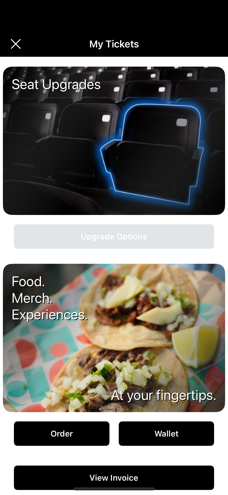   | 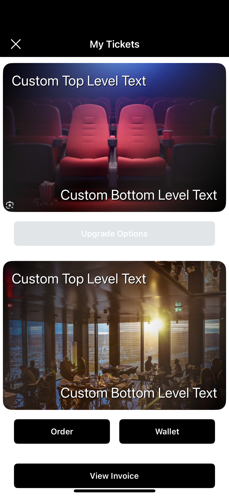   |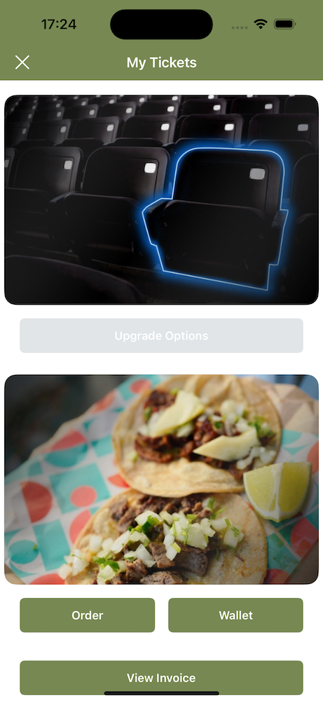   |
| android    |    | 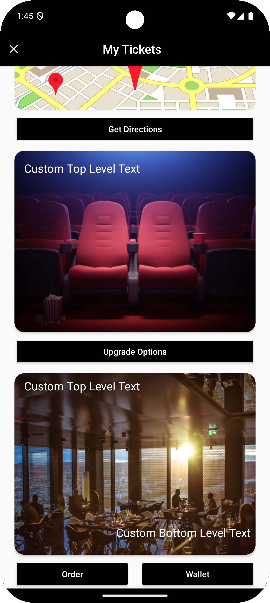   |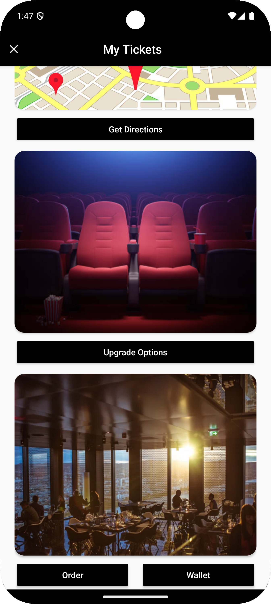   |

### Custom Modules

You can configure up to 3 buttons as a custom module. Each button accepts a callback function. An optional `headerView` can be displayed above the buttons — either a solid color, a bundled image via `require()`, or a remote image via `{ uri: '...' }`.

```typescript
<IgniteProvider
  options={{
    apiKey: API_KEY,
    clientName: CLIENT_NAME,
    primaryColor: PRIMARY_COLOR
  }}
  customModules={{
    headerView: {
      image: require('./assets/my_module_header.png'),
    },
    button1: {
      enabled: true,
      title: 'My Button 1',
      callback: () => console.log('Button 1 called!'),
    },
    button2: {
      enabled: true,
      title: 'My Button 2',
      callback: () => console.log('Button 2 called!'),
    },
    button3: {
      enabled: true,
      title: 'My Button 3',
      callback: () => console.log('Button 3 called!'),
    },
  }}
>
  <App />
</IgniteProvider>
```

`headerView` accepts a bundled image, a remote image, or a solid color:

```typescript
// Bundled image (use require() — Metro resolves the asset at build time)
headerView: { image: require('./assets/my_module_header.png') }

// Remote image (pass an object with a `uri`)
headerView: {
  image: {
    uri: 'https://www.example.com/path/to/my_module_header.png',
  },
}

// Solid color header
headerView: { color: '#026cdf' }
```

Single button example:

```typescript
<IgniteProvider
  options={{
    apiKey: API_KEY,
    clientName: CLIENT_NAME,
    primaryColor: PRIMARY_COLOR
  }}
  customModules={{
    button1: {
      enabled: true,
      title: 'My Button 1',
      callback: () => console.log('Button 1 called!'),
    },
  }}
>
  <App />
</IgniteProvider>
```

| iOS    | Android|
| ------ | ------ |
|   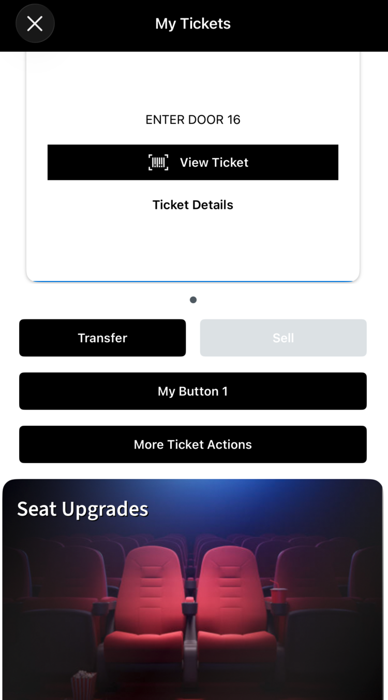     |   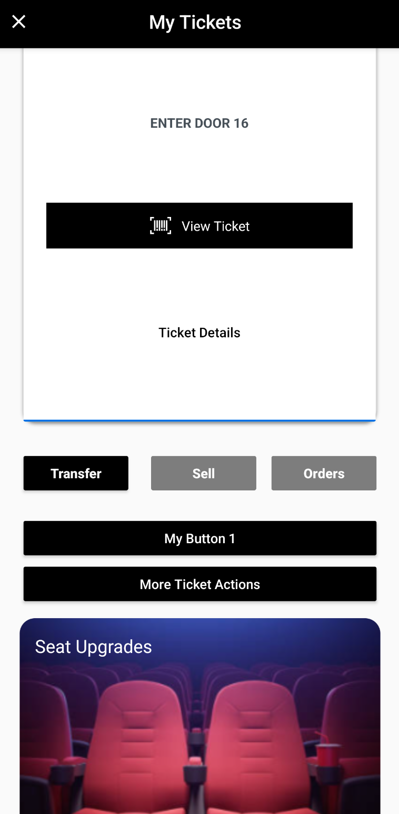     |
|   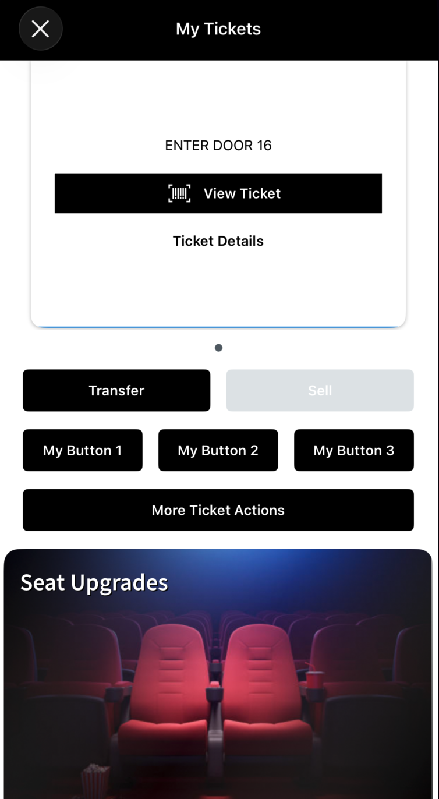     |    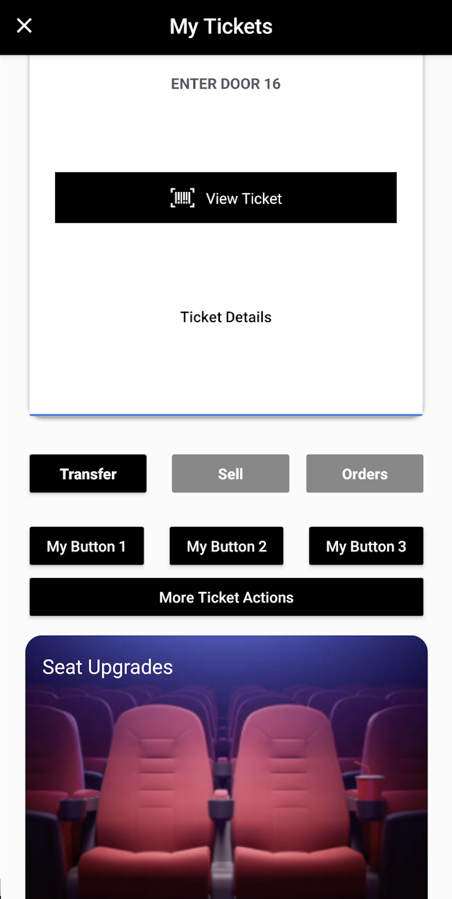    |

#### Opening a URL from a button

Use React Native's `Linking` API in the `callback` to open an external URL when a custom button is tapped:

```typescript
import { Linking } from 'react-native';

<IgniteProvider
  options={{
    apiKey: API_KEY,
    clientName: CLIENT_NAME,
    primaryColor: PRIMARY_COLOR
  }}
  customModules={{
    button1: {
      enabled: true,
      title: 'Visit Ticketmaster',
      callback: () => Linking.openURL('https://www.ticketmaster.com'),
    },
  }}
>
  <App />
</IgniteProvider>
```

### Analytics

You can send a callback method to `IgniteProvider` to receive Ignite SDK analytics in your app which you can then send off to your chosen analytics service.

To see the full list of available analytics in this library see: [Analytics](./analytics.md)

```typescript
import { IgniteProvider, IgniteAnalytics, IgniteAnalyticName } from 'react-native-ticketmaster-ignite';

const igniteAnalytics = async (data: IgniteAnalytics) => {
    const key = Object.keys(data)[0];
    switch (key) {
      case IgniteAnalyticName.PURCHASE_SDK_DID_BEGIN_TICKET_SELECTION_FOR:
        console.log(
          'EDP started for',
          data.purchaseSdkDidBeginTicketSelectionFor.eventName
        );
    }
  };

<IgniteProvider
  options={{
    apiKey: API_KEY,
    clientName: CLIENT_NAME,
    primaryColor: PRIMARY_COLOR
  }}
  analytics={igniteAnalytics}
>
    <App />
</IgniteProvider>
```

#### Navigate to a Tickets Tab after purchase

This example uses [React Navigation](https://reactnavigation.org/docs/6.x/navigating-without-navigation-prop) and Redux Toolkit, you'll have to replace those code lines with your chosen navigation and state management methods.

```typescript
import {
  IgniteAnalytics,
  IgniteAnalyticName,
} from 'react-native-ticketmaster-ignite';
import * as RootNavigation from './RootNavigation';
import { store } from '../redux/store';
import { setExampleValue } from '../redux/slices/example';

const igniteAnalytics = async (data: IgniteAnalytics) => {
  const key = Object.keys(data)[0];
  switch (key) {
    // iOS
    case IgniteAnalyticName.PURCHASE_SDK_DID_END_CHECKOUT_FOR:
      if (
        data.purchaseSdkDidEndCheckoutFor.reason === 'userCompletedPurchase'
      ) {
        store.dispatch(setExampleValue('Random Value')); // Example - Not needed for navigation
        RootNavigation.navigate('BottomTabs', {
          screen: 'MY TICKETS',
        });
      }
      break;
    // Android
    case IgniteAnalyticName.PURCHASE_SDK_MANAGE_MY_TICKETS:
      RootNavigation.navigate('BottomTabs', {
        screen: 'MY TICKETS',
      });
      break;
  }
};
```

If you want the `<TicketsSdkEmbedded />` component to perform a fresh call upon navigating to the screen/tab after purchase be sure to pass an `isFocused` boolean to the component. Example below:

```typescript
  const isFocused = useIsFocused();

  return (
    <TicketsSdkEmbedded
      isFocused={isFocused}
    />
  );
```

### Debugging/Logging

To turn on useful logging to inspect data and for debugging you can turn on logging by passing `true` to the `enableLogs` prop on `IgniteProvider`

```typescript
<IgniteProvider enableLogs={true}>
  <App />
</IgniteProvider>
```

Or use callbacks/exceptions/analytics/returned method data to create your own debug logs

Example Accounts SDK configuration callback log example:

```typescript
  const { refreshConfiguration } = useIgnite()

const onConfigurationSuccess = () =>
  console.log('Accounts SDK configuration successful');

 useEffect(() => {
    const configureIgniteSdks = async () => {
      try {
        await refreshConfiguration({
          apiKey: 'someApiKey',
          clientName: 'Team 2',
          primaryColor: '#FF0000',
          onSuccess: onConfigurationSuccess,
        })
      } catch (e) {
        console.log(
          'Account SDK refresh configuration error:',
          (e as Error).message
        )
      }
    }
    configureIgniteSdks()
  }, [refreshConfiguration])
```


As the initial Accounts SDK configuration is done for your app via `IgniteProvider`, any failures in this process will still be logged, as if the Accounts SDK configuration fails then none of the Ignite SDK's will work in your application.


On any logs of `TicketmasterFoundation.ConnectionError error` see [here](https://github.com/ticketmaster/react-native-ticketmaster-ignite?tab=readme-ov-file#refresh-token)
